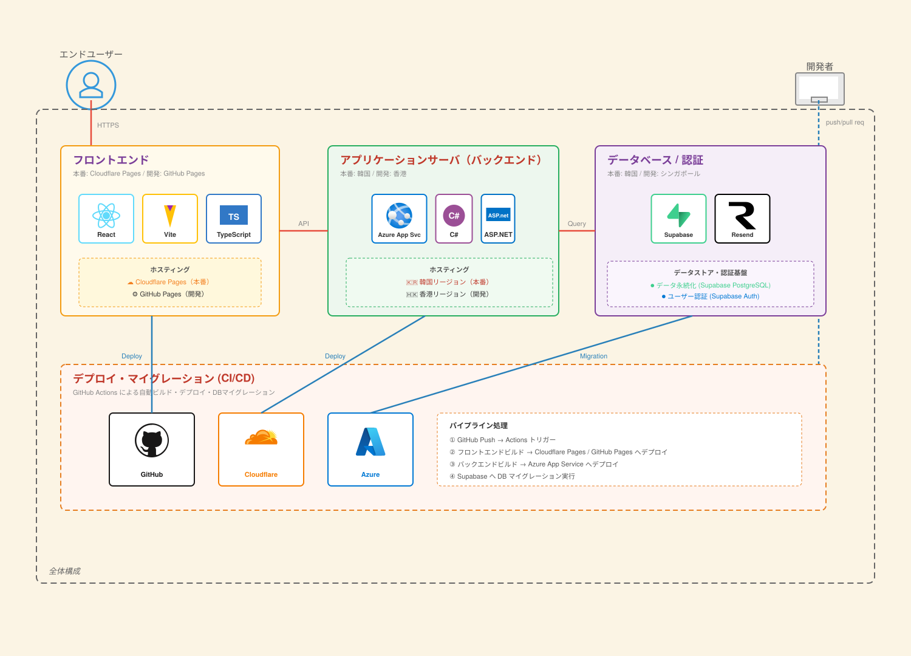

# README

## 開発資料

- [こちら](https://docs.google.com/presentation/d/1CH4CUAGjw3HgIID_wlaz-j8JuY-V16gEYpGhag1mcgM/edit?usp=sharing)よりご覧いただけます。

## 集計データ

- プレイヤーがどのくらい遊んだか等をまとめたデータは、[こちら](https://ayumu203.github.io/nisekue-report/)からご覧いただけます。

## 公開先

- 以下のリンクよりゲームをプレイすることができます。
- [本番用](https://game.arm203.org/)
- [開発用(開発者が確認する用途)](https://ayumu203.github.io/nisekue/)

## 作ったもの

- 某ゲームのオマージュゲー開発.
- 冒険やエンドレスバトル等を実装する.

## システムのアーキテクチャ構成



### フロントエンド

- React + Vite
- MUI(Material UI)
- 

### バックエンド

- .NET(Minimal API)
- EF Core(Entity Framework Core)
- xUnit
- SignalR
- 

### インフラ

- Supabase(DB・認証)
- GitHub Pages(フロントエンド公開先)
- Azure App Service(バックエンド公開先)
- 

## 実行方法

- 各実行方法は以下のとおりである.

### フロントエンド

- 以下バージョンは参考.

```bash
$ node -v
v25.7.0
$ npm -v
11.10.1
```

- 以下でフロントエンドを起動.

```bash
# client内で実行.
pnpm dev
```

### バックエンドサーバ

- `.NET Core 10.0` で動作.

```bash
# server内で実行.
$ dotnet run
```

### バックエンドテスト

```bash
# tests/server.tests内で実行.
$ dotnet test
```

### Supabase

- 起動関連

```bash
# 初回のみ
$ pnpx supabase init
# 起動
$ pnpx supabase start
# 各種サービスの確認
$ pnpx supabase status
# 停止
$ pnpx supabase stop
```

## ライセンス

- プログラム: [MIT License](./LICENSE)
- 画像データ: MITライセンスの適用外です。二次配布・改変を禁止しているものが大半のため、クレジット(スペシャルサンクスのページ)をよく参照し、それぞれの規約に反しない範囲での利用をお願いします。
