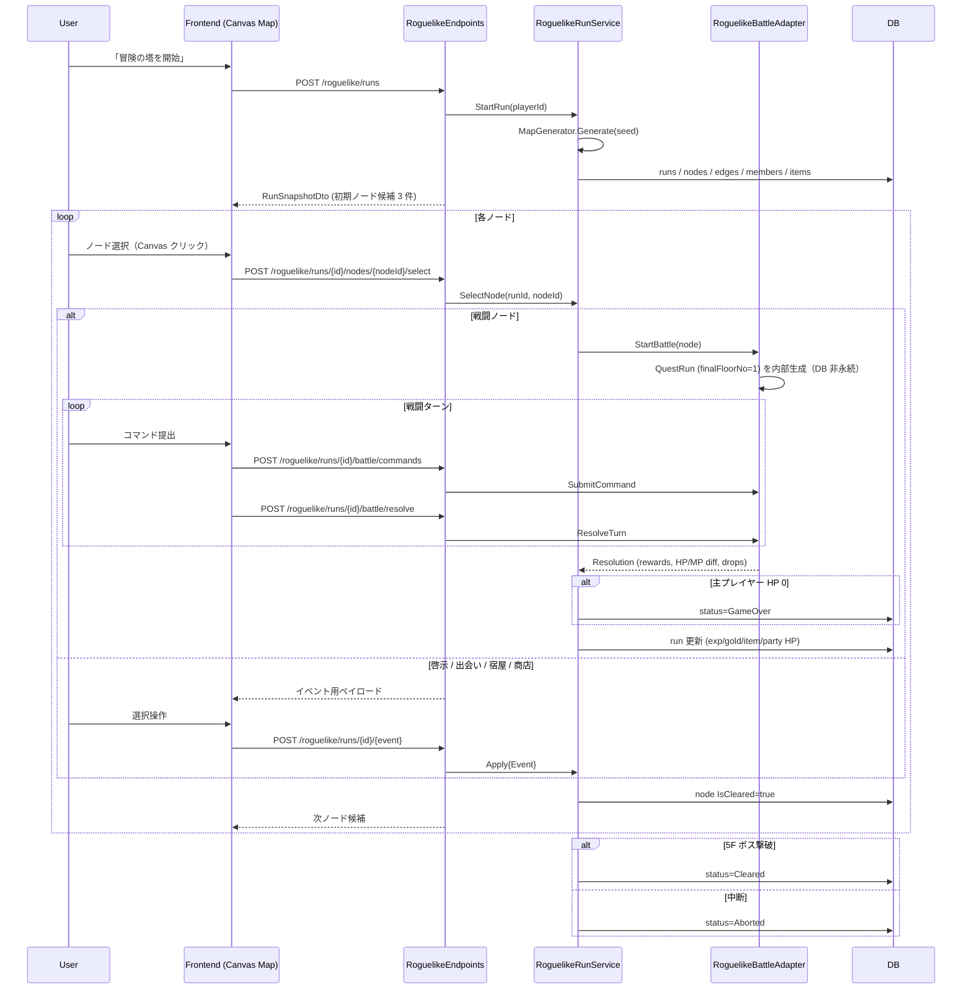

# ローグライク（冒険の塔）詳細仕様書

本書は `docs/roguelike/01_ローグライク仕様書.md` の内容を、実装担当が単独で着手できる粒度まで落とし込んだ **確定仕様書** である。
既存ドメイン（クエスト・プレイヤー・アイテム・職業・NPC・バトル）のうち何を再利用し、何を拡張し、何を新規に作るかを明示し、
01 仕様書で決定不能だった論点はすべて本書内で確定させている（第 24 章「決定済み事項」参照）。

- 対象リビジョン: `docs/roguelike` ブランチ (2026-04-22 時点)
- 原典: `docs/roguelike/01_ローグライク仕様書.md`
- ゲーム内表示名: **「冒険の塔」**
- 実装担当: 別エージェントへ依頼予定のため、本書はクラス／CSV／API まで完全明記する。
- 01 仕様書は概要文書であり、差異がある場合は本書を優先する。

---

## 目次

1. 目的とスコープ
2. 用語定義
3. 全体フロー
4. ラン構造とマップ生成
5. ノードイベント種別
6. 戦闘イベント
7. 啓示（転職）
8. 出会い（仲間獲得）
9. 宿屋
10. 商店
11. ローグライクプレイヤー / パーティ
12. アイテム（ローグライク）
13. 職業拡張（ローグライク専用 Job）
14. ラン終了条件
15. ドメインモデル設計（全クラススケルトン）
16. DB スキーマ
17. CSV マスタ
18. アプリケーションサービス（全クラススケルトン）
19. API エンドポイント
20. リアルタイム通信方針
21. フロントエンド構成
22. 既存仕様との衝突点
23. テスト方針
24. 決定済み事項（旧 Open Questions）

付録 A: 再利用マトリクス / 付録 B: 新規実装一覧 / 付録 C: ER 図追記ブロック

---

## 1. 目的とスコープ

### 1.1 目的

にせくえに常設のローグライクモード「**冒険の塔**」を追加し、**1 プレイヤー × 1 ラン使い切り** で遊べるコンテンツを提供する。
既存の対パーティ戦闘（QuestRun）のアセットを最大限に流用しつつ、マップ進行・店舗・宿屋・啓示・仲間加入・アイテム/スキル共有という、クエストにない要素を新規実装する。

### 1.2 対象範囲

| 範囲 | 取り扱い |
| --- | --- |
| 単独プレイによるローグライクラン | 対応 |
| ラン中の戦闘は QuestRun の流用で実施 | 対応 |
| ラン結果のログ保存（到達階層・所要時間・獲得物） | 対応 |
| 各階層固有のジョブ／アイテム／敵／ボス | 対応 |
| マルチプレイヤー同時ラン | 非対応 |
| リアルタイム同期（SignalR） | 非対応（第 20 章） |
| 本番 Player ステータスへの還元 | 行わない（ラン中のデータは破棄） |
| ランキング連動 | 本仕様のスコープ外（ログテーブルは残し、将来実装できる形にする） |

### 1.3 ラン状態の独立性

- ラン中のプレイヤー状態（Level / Status / Job / MoveSet / 装備 / アイテム）は本番 `Player` テーブルからは **完全に分離** し、ローグライク専用テーブルで独立管理する。
- ラン終了時（Cleared / GameOver / Aborted 問わず）、ラン中に獲得した Exp・Gold・装備・アイテムはすべて破棄される。
- ラン開始時、主プレイヤーは **固定の初期ステータス（Lv1 Apprentice）** から始まる（第 11 章）。本番 Player のレベルや装備は反映しない。

---

## 2. 用語定義

| 用語 | 意味 | クエスト側対応 |
| --- | --- | --- |
| ラン（Run） | ローグライクの 1 プレイセッション。開始から成功／失敗／中断まで | `QuestRun`（永続化概念は別） |
| マップ（Map） | ラン開始時に確定する「ノードのグラフ」 | クエストの `stage_floors.csv` に相当 |
| ノード（Node） | マップ上の 1 マス。単一イベントを持つ | クエストの `floor` に相当 |
| 階層（Floor） | 5 層構造の 1 層。`floor_no ∈ [1..5]` | クエストの `stage` に相当 |
| イベント（Event） | ノードで発生する処理。戦闘／啓示／出会い／宿屋／商店の 5 種 | クエストでは戦闘のみ |
| ローグライクパーティ | ラン中の味方 1〜5 名（主プレイヤー + NPC 仲間） | `QuestRunPartyMemberSnapshot` に相当 |
| ローグライクアイテム | ラン中のみ有効なアイテム（上限 20 個） | 既存 `Item` / `PlayerItemStack` とは別ドメイン |
| 啓示 | ローグライク専用の転職イベント | `PlayerJobService.ChangeJobAsync` と同等の機構を別サービスで |
| 啓示ジョブ | ローグライク専用の追加 Job（第 13 章） | 既存 `Job` enum に追加 |
| 主プレイヤー | ラン中の味方スロット 1 に配置される、プレイヤー自身のキャラ | - |
| スロット | パーティ 1..5 / インベントリ 1..20 の位置 | - |

---

## 3. 全体フロー



### 3.1 一方向進行の原則

- プレイヤーは「現在ノードから接続された未踏ノード」のみ選択できる。
- **一度通過（`IsCleared = true`）したノードへは絶対に戻れない**。
- ラン途中でのリセット・巻き戻しは提供しない。
- ノード解決後に `reachableNodeIds` が 0 件になった場合、ランは即時 `GameOver` とする。

---

## 4. ラン構造とマップ生成

### 4.1 マップ全体構造

- 階層数: **5**
- 各階層のノード列数 `n`:
  - 階層 1: `n = 3` → 9 ノード
  - 階層 2: `n = 4` → 12 ノード
  - 階層 3: `n = 5` → 15 ノード
  - 階層 4: `n = 5` → 15 ノード
  - 階層 5: `n = 7` → 21 ノード
- 合計 **72 ノード**。
- 各階層は「3 行 × n 列」の格子。列 1 はラン開始候補 3 ノード、列 n はボスノード（全ルート合流点）。
- `row_no` / `rowNo` は **0 始まり（0..2）** とする。

### 4.2 接続ルール

- **列間接続**: 列 `c` の行 `r` のノードは、列 `c+1` の行 `r-1 / r / r+1`（端は clamp）のいずれかに 1〜2 本の辺を持つ。最低 1 本の後続接続を保証する。
- **クロス接続**: 各階層ごとに確率 `p_cross = 0.25` で、隣接していない行間の辺を 1 本追加する（`floor_configs` で上書き可）。
- **ボス合流**: 列 `n-1` の全ノードは列 `n` のボスノードに接続される。
- **階層間接続**: ある階層のボスノードから、次階層の列 1 にある 3 ノード全てに接続される。プレイヤーは次階層の開始列を自由に選び直せる。
- **到達保証**: マップ生成後、BFS でボスノードまでの到達可能性をすべてのスタートノードから検証し、到達不能の場合はリトライ（最大 10 回）。

### 4.3 イベント種別の抽選

- マップ生成時、各ノードに 1 種類のイベントが確定する。
- 列 `n`（ボスノード）は確定で `Battle(Boss)`。
- それ以外のノードは階層ごとの重みテーブル `roguelike_event_weights.csv` を参照し、以下 5 種から抽選:
  - `Battle(Normal)` / `Oracle(啓示)` / `Encounter(出会い)` / `Inn(宿屋)` / `Shop(商店)`
- 同一列で同一種が 3 個以上並ばないよう再抽選（最大 10 回）。
- `parameters_json` の内容（敵編成・啓示候補・出会い候補・商店品揃え）は **ノード生成時に確定して固定** する。

### 4.4 決定論と Seed

- マップは `RoguelikeRun.Seed`（`long`）から決定論的に生成する。
- Seed はラン開始時にサーバー側で `DateTimeOffset.UtcNow.Ticks ^ Guid.NewGuid().GetHashCode()` で生成し、`roguelike_runs.seed` に永続化する。
- 中断→再開時も同じマップが再現されることを保証する。

### 4.5 階層ごとの出現プール

以下はマップ生成／イベントペイロード抽選時に、**当該階層専用** のマスタ行のみを参照する。これにより階層ごとに出現する敵／ボス／ジョブ／アイテムがすべて異なる：

- 敵スポーン: `roguelike_enemy_spawns.csv` の `floor_no` で絞る
- ボススポーン: `roguelike_enemy_spawns.csv` の `floor_no + is_boss_spawn=true` で絞る
- 啓示ジョブ候補: `roguelike_job_candidates.csv` の `min_floor ≤ floor_no ≤ max_floor`
- 仲間 NPC: `roguelike_floor_npc_pool.csv` の `floor_no` で絞る
- 商店ラインナップ: `roguelike_shop_offers.csv` の `floor_no` で絞る

各 CSV は後述する階層別のラインナップを持つ（第 17 章）。

---

## 5. ノードイベント種別

| 種別 | ID 値 | 概要 | 詳細章 |
| --- | --- | --- | --- |
| 戦闘 | `Battle = 1` | 敵 1〜6 体と単発バトル（ボス含む） | 第 6 章 |
| 啓示 | `Oracle = 2` | 3 候補から転職先を選択 | 第 7 章 |
| 出会い | `Encounter = 3` | 2〜3 候補から NPC を仲間に | 第 8 章 |
| 宿屋 | `Inn = 4` | Gold を支払い HP/MP 回復 | 第 9 章 |
| 商店 | `Shop = 5` | Gold でアイテム購入 | 第 10 章 |

各イベントの共通構造:

- **入口条件**: 現在ノードから `IsCleared = false` な接続先ノードに限る
- **ペイロード**: イベント固有データ（敵セット ID、NPC 候補リスト、商店品揃え等）を `roguelike_nodes.parameters_json` に保持
- **ユーザー入力**: 戦闘以外は 1 回のユーザー操作で解決
- **結果適用**: `RoguelikeRun` 配下のテーブルを更新
- **クリア処理**: `RoguelikeNode.IsCleared = true` にセットし、移動候補から除外

---

## 6. 戦闘イベント

### 6.1 概要

- 1 ノード = 1 戦闘。既存 `QuestRun` を **1 フロア限定**（`finalFloorNo = 1`）で一時生成し、解決後に破棄する。
- 戦闘状態は `RoguelikeRun` 側でなく一時 `QuestRun` で管理。`RoguelikeRun` には最終結果（勝敗、獲得 Exp/Gold、パーティ HP/MP/状態異常の最終値、ドロップ）のみ反映する。
- 一時 `QuestRun` は **DB に永続化しない**（`RoguelikeBattleAdapter` のプロセス内メモリで保持し、戦闘終了時に破棄）。

### 6.2 再利用コンポーネント

| 既存 | 役割 | 参照 |
| --- | --- | --- |
| `QuestRun` | ターン進行の集約 | `server/domain/quest/run/QuestRun.cs` |
| `QuestBattleState` | パーティ＋敵の状態 | `server/domain/quest/run/QuestBattleState.cs` |
| `QuestTurnState` | ターン／期限 | `server/domain/quest/run/QuestTurnState.cs` |
| `QuestRewardAccumulator` | Exp/Gold/装備/アイテム集計 | `server/domain/quest/run/QuestRewardAccumulator.cs` |
| `QuestEnemyDefinition` / `QuestEnemyPlacement` | 敵定義・配置 | `server/domain/quest/master/*` |
| `BattleService` | 行動解決 | `server/application/battle/*` |

### 6.3 戦闘ノード仕様

- 1 ノードの敵数: **1〜6 体**（通常ノードは 1〜3 体、ボスノードは 1〜6 体で CSV 指定）
- ターン制限: 既存クエストと同じタイムアウト値（`QuestTurnState` の既定値）
- 味方サイド: 最大 5 名 / 敵サイド: 最大 6 体

### 6.4 報酬反映ルール

- 通常敵: `roguelike_enemy_spawns.csv` の `exp_rate` / `gold_rate` を乗じる
- ボス敵: 同 CSV の `is_boss_spawn=true` 行を使用し、報酬倍率を通常比 1.5〜2.0 倍に
- ドロップ装備はローグライクインベントリに「装備アイテム」として格納（第 12 章）
- ドロップアイテムも同じく 20 枠インベントリに格納。枠満杯時はドロップを破棄するダイアログを戦闘終了時に表示

### 6.5 主プレイヤー死亡によるラン失敗

- 戦闘中に主プレイヤー（スロット 1）の HP が 0 になった時点で、その戦闘は即時中断され、ラン全体が `GameOver` へ遷移する（第 14 章）。
- 戦闘中断時は `QuestRun.Abort("PlayerDownInRoguelike")` を呼び、一時 `QuestRun` を破棄する。

### 6.6 逃走の取扱い

- `ActionKind.Escape` 提出時は、そのノードを「未クリア」状態のまま離脱扱いとし、元ノード（直前ノード）へは戻らず、**当該ノードを含む全接続先を選択不能**にする（一方向進行原則のため、戦闘から逃げたノードは以後進めなくなる＝実質的に行き止まり）。
- 戦闘逃走はペナルティ（Exp/Gold なし、パーティ HP はその時点で固定）を持つ。
- 逃走後に到達可能ノードが 0 件となった場合は、その場で `GameOver` とする（第 14.2）。

---

## 7. 啓示（転職）

### 7.1 仕様

- 3 候補の「啓示ジョブ」をランダム提示し、1 つ選択で主プレイヤー（スロット 1）が転職。
- 「スキップ」ボタンで見送り可能（ノードは `IsCleared = true`）。
- ラン内限定の転職。本番 `Player.Job` は変更しない。

### 7.2 候補抽選

- プール: `roguelike_job_candidates.csv`
  - 列: `job, min_floor, max_floor, weight, requires_mastered_job`
- **ノード生成時** に現在階層を満たす行から重み付きで 3 件抽選（重複なし）し、`parameters_json.jobCandidates` に固定保存する。候補が 3 未満の場合は存在する分だけ保存する。
- `requires_mastered_job` は「このラン中に過去到達した啓示ジョブ」を必須とする系譜制約。**今回の実装では全行で空（制約なし）** とするが、列はスキーマに残す（将来拡張のため）。

### 7.3 転職処理

- `PlayerJobService.ChangeJobAsync` は使用せず、`RoguelikeOracleService` が `IJobProfileRepository.GetByJob` / `IJobMoveLearningRuleRepository.GetByJob` を直接呼び、主プレイヤースロットへ適用。
- 本番転職の制約（Lv5 以上・マスタージョブ要求等）は **無視** する。ラン固有の成長管理のため。

### 7.4 制約

- **同一ラン内で同じ啓示ジョブへの再転職は不可**。表示時に `parameters_json.jobCandidates` のうち既到達ジョブを無効化し、有効候補が 0 件なら自動スキップとする。
- 転職時、主プレイヤーの JobLevel/JobExp はリセット（新ジョブ Lv1 から）。Player Level / Exp / MoveSet の習得済みスキルは維持。

---

## 8. 出会い（仲間獲得）

### 8.1 仕様

- 2〜3 名の NPC 候補を提示し、1 名選択で仲間に加入。
- パーティ上限 **5 名**（主プレイヤー含む）。既に 5 名の場合は「既存仲間 1 名を除外」→「新仲間を加入」の 2 段操作。
- 「スキップ」で見送り可能。

### 8.2 候補抽選

- プール: `roguelike_floor_npc_pool.csv`（階層別）
  - 列: `floor_no, npc_template_id, weight`
- **ノード生成時** に重み付きで 3 件（重複なし、候補不足時は存在分）を抽選し、`parameters_json.npcTemplateIds` に固定保存する。
- 既存 `QuestNpcTemplate`（`resources/quest/npc_templates.csv`）を `npc_template_id` で参照し、Name / Job / PreferredRow / MoveIds / NpcRole を得る。

### 8.3 初期ステータス（レベルスケーリング）

- 加入 NPC のレベルは **当該ノード到達時点のパーティ平均レベル** を基準に決定する:
  - `npcLevel = max(1, floor(avg(party.Level)))`
- ステータスは `QuestNpcTemplate` を基準テーブルとして、テンプレートが持つレベル `L_tpl` に対して以下の線形スケーリングを行う:
  - `scaledStat = floor(templateStat * npcLevel / L_tpl)`（各ステータス値について）
- `CurrentHp = MaxHp`, `CurrentMp = MaxMp` で加入。
- MoveSet は `QuestNpcTemplate.MoveIds` をそのまま使用。

### 8.4 除外仕様

- 除外対象: 「主プレイヤー（スロット 1）以外のいずれか 1 名」
- 除外した NPC の装備・アイテム・Exp はすべて破棄（還元なし）。
- 除外スロットは空になり、新 NPC がそこに加入する。

---

## 9. 宿屋

### 9.1 料金計算

```
totalLevel = sum(partyMember.Level for partyMember in Party)  // 主プレイヤー + NPC 全員
fullCost = totalLevel * 10
```

### 9.2 支払いと回復

| 条件 | 挙動 |
| --- | --- |
| 所持 Gold ≥ fullCost | Gold を fullCost 消費し、全員 HP/MP を最大値まで回復、状態異常を解除 |
| 0 < 所持 Gold < fullCost | 回復率 `ratio = floor(owned / fullCost * 100)` % を HP/MP に適用、所持 Gold を全量消費 |
| 所持 Gold = 0 | 使用不可（ボタン無効） |
| fullCost = 0（全員 Lv0、理論上発生しない） | Gold 0 消費で全回復（処理続行） |

- 部分回復時: `recoveredHp = floor(maxHp * ratio / 100)`, `recoveredMp = floor(maxMp * ratio / 100)` を加算（ただし最大値 cap）
- **端数処理はすべて切り捨て（floor）**
- 状態異常解除は「全回復または部分回復いずれでも実施」する

### 9.3 スキップ

- 宿屋ノードは「利用しない」ボタンで未使用のままクリア可能。

---

## 10. 商店

### 10.1 品揃え

- ノードごとに 3〜5 個のアイテムを抽選（ランダム）。ノード生成時に確定し `parameters_json` に保持。
- `roguelike_shop_offers.csv`（階層別）から `weight` に応じて重み付き抽選（重複なし）。
- 価格 = `base_price × floor_price_multiplier`（`roguelike_floor_configs.csv` の階層係数）

### 10.2 購入操作

- 1 リクエストで 1 アイテム 1 個購入。
- 購入失敗条件: Gold 不足 / 在庫なし / インベントリ満杯（20 枠）
- 枠満杯時はフロントで破棄 UI（`POST /roguelike/runs/{id}/items/{slotNo}/discard`）を促す。

### 10.3 離脱後

- 商店ノードはクリア済みになると再訪不可（一方向進行）。残り在庫はそのまま破棄。

---

## 11. ローグライクプレイヤー / パーティ

### 11.1 基本方針

- 本番 `Player`（`internal.players`）とは別テーブルで管理（`internal.roguelike_run_members`）。
- ラン中の Level / Exp / JobLevel / JobExp / Gold / Status / Job / MoveSet はローグライク専用レコードで完結。ラン終了時に破棄。

### 11.2 スナップショット生成（ラン開始時）

- 主プレイヤー（スロット 1）は **固定の初期値** で開始:
  - Name: 本番 `Player.Name` を表示に借りる（レコード上は `display_name`）
  - Job: `Job.Apprentice`
  - Level: 1
  - JobLevel: 1 / Exp: 0 / JobExp: 0
  - Status: `Apprentice` の Lv1 初期値（`job_levelup_growths.csv` の Apprentice 行 × Lv1 ＝ HP 14, MP 12, Str 12, Def 12, Int 12, Luck 11, Speed 11 相当を採用。最終値は CSV 読込時の 1 ポイント補正で決定）
  - MoveSet: 空（Apprentice の習得可能スキルを習得するのみ）
  - Gold: 100（新ラン用スタート値）
- NPC スロット（2..5）はラン開始時は空。出会いイベントで加入する。

### 11.3 成長モデル

- **全員成長**。戦闘で得た `exp` は主プレイヤーと生存 NPC 全員に均等配分（小数切り捨て）。
- 各メンバーは個別の Level / JobLevel を持ち、`Player.LevelUp` と同等のルールでレベルアップ処理を行う（`JobProfile.GrowthValue` 参照）。
- NPC も加入後にマスタージョブへ到達すれば `MasteredJobs` を記録（ランスコープ）。ただし啓示による転職は主プレイヤーのみ適用。

### 11.4 装備

- ランに装備を持ち込まない（本番 `Player.Equipment` は参照しない）。
- ラン中のドロップ装備はローグライクインベントリに「装備アイテム」カテゴリで格納され、使用することで対象スロットの装備スロットへ装着される（第 12 章）。
- ラン中に装着した装備は `RoguelikePartyMember.WeaponRoguelikeItemId` / `ArmorRoguelikeItemId` で管理。
- ラン終了時、装備はすべて破棄。

---

## 12. アイテム（ローグライク）

### 12.1 インベントリ

- 最大 **20 スロット**（01 仕様書の「10」は本書で 20 に上書き決定）。
- スタック非対応、1 スロット = 1 アイテム（`count = 1` 固定）。

### 12.2 マスタデータ

- **新規ファイル**: `server/resources/roguelike/roguelike_item_master.csv`
- 既存の `resources/player/item_master.csv` とは独立（ID 空間も分離）。
- 列: `rogue_item_id, name, flavor_text, category, floor_availability_min, floor_availability_max, grant_move_id, base_price, equipment_type`
  - `category`: `Consumable` / `Equipment`（装備アイテム）/ `JobToken`（転職用）/ `Buff`
  - `grant_move_id`: 使用時に発動する Move ID（`resources/move/move_master.csv` 参照）。`Equipment` の場合は NULL。
  - `equipment_type`: `None` / `Weapon` / `Armor`（`Equipment` カテゴリのみ）
- 各階層で入手できるアイテムは `floor_availability_min..max` で制限（階層ごとに異なるラインナップ）。

### 12.3 効果体系（B 案）

- **別ドメイン方式** を採用。既存 `server/domain/player/Item.cs` には手を入れない。
- 新規 `server/domain/roguelike/item/` 配下に以下を置く:
  - `RoguelikeItemDefinition`（マスタ定義）
  - `RoguelikeItemStack`（インベントリ 1 スロット）
  - `RoguelikeItemCategory`（enum）
  - `RoguelikeItemUseContext`（効果適用時のコンテキスト）
  - `IRoguelikeItemMasterRepository`
- 使用時は `RoguelikeItemUseService` が `grant_move_id` を `IMoveRepository` で解決し、`MoveEffect` パイプライン（`server/domain/move/MoveEffect.cs`）を流用して効果を適用する。
- 戦闘中使用と戦闘外使用でコンテキストを切り替え:
  - 戦闘中: 既存 `BattleService` と統合し、`MoveEffect` を現ターン解決内で適用
  - 戦闘外: パーティメンバー直接適用（回復・バフは即時反映）

### 12.4 使用 UX

- 戦闘中: 行動コマンドの新種別として `ActionKind.UseItem` を既存 `server/domain/quest/enums/ActionKind.cs` に追加（値 `= 8`）。ローグライク戦闘のコマンド提出 API にのみ使用。
- 戦闘外: `POST /roguelike/runs/{id}/items/{slotNo}/use` で実行。
- `Equipment` カテゴリは使用時に装着処理（スロット交換→旧装備は破棄）。

---

## 13. 職業拡張（ローグライク専用 Job）

### 13.1 追加 Job 一覧

以下 8 職を新設する。`Job` enum 値は 100 以上に割り当て（既存 `Job.GreatThief = 25` との衝突回避）。

| 値 | enum 名 | 表示名 | 役割 | 習得スキル傾向 |
| --- | --- | --- | --- | --- |
| 101 | `Fighter` | ファイター | 物理単体攻撃特化 | 単体高火力・命中補正 |
| 102 | `Enchanter` | エンチャンター | 味方バフ／敵デバフ | バフ・デバフ（BuffEffect） |
| 103 | `Alchemist` | アルケミスト | アイテム効果強化・自己回復 | HP 回復・アイテム消費軽減 |
| 104 | `Berserker` | バーサーカー | 高火力・高リスク（自傷含む） | 自傷ダメージ→大ダメージ |
| 105 | `Breaker` | ブレイカー | 物理範囲攻撃特化 | 列／全体物理攻撃 |
| 106 | `Shaman` | シャーマン | 属性デバフ・範囲魔法 | 属性耐性低下＋範囲魔法 |
| 107 | `Commander` | コマンダー | パーティ行動支援 | 味方追加行動・敵行動妨害 |
| 108 | `Seer` | シーア | 予見・回避補正 | 回避率・クリティカル率補正 |

### 13.2 成長値（job_levelup_growths.csv 追加行）

戦士・魔法使い等の基本職相当を目安に以下を追加する:

| Job | max_hp | max_mp | str | def | int | luck | speed |
| --- | --- | --- | --- | --- | --- | --- | --- |
| Fighter | 6 | 1 | 4 | 2 | 0 | 1 | 1 |
| Enchanter | 4 | 4 | 0 | 1 | 3 | 2 | 1 |
| Alchemist | 5 | 3 | 1 | 1 | 3 | 1 | 1 |
| Berserker | 7 | 0 | 5 | 1 | 0 | 0 | 2 |
| Breaker | 6 | 1 | 4 | 2 | 0 | 0 | 2 |
| Shaman | 4 | 3 | 0 | 1 | 4 | 1 | 1 |
| Commander | 5 | 2 | 2 | 2 | 1 | 2 | 1 |
| Seer | 4 | 3 | 1 | 1 | 2 | 2 | 2 |

- `master_level = 20`（基本職相当）
- 必要マスタージョブは全行空（啓示は条件なしで選べるため）

### 13.3 習得スキル（job_moves.csv 追加行）

各 Job の `job_moves.csv` 追加行は以下で**確定**する（列順: `move_1..move_5`）。

| Job | move_1 | move_2 | move_3 | move_4 | move_5 |
| --- | --- | --- | --- | --- | --- |
| Fighter | 101 | 138 | 414 | 405 |  |
| Enchanter | 402 | 606 | 403 | 413 | 602 |
| Alchemist | 301 | 310 | 513 | 307 |  |
| Berserker | 129 | 134 | 404 | 415 |  |
| Breaker | 102 | 103 | 104 | 611 |  |
| Shaman | 203 | 204 | 205 | 422 |  |
| Commander | 421 | 518 | 402 | 414 |  |
| Seer | 405 | 406 | 516 | 517 |  |

### 13.4 CSV 登録

- `resources/player/job_levelup_growths.csv` に 8 行追加
- `resources/player/job_moves.csv` に 各 Job の習得行を追加
- `resources/player/job_profiles`（= `job_levelup_growths.csv` が兼ねる）

### 13.5 本番シナリオからの遮断

- `PlayerJobService.BaseJobs` には **追加しない**。
- `PlayerJobService.ChangeJobAsync` の経路からは到達不能。
- 本番クエストの転職アイテム（`item_master.csv` の ChangeJob 系）にも登場させない。

---

## 14. ラン終了条件

### 14.1 成功（Cleared）

- 階層 5 の最終ボスノード（列 7）の戦闘に勝利した時点。
- `RoguelikeRun.Status = Cleared`, `EndedAt = UtcNow`

### 14.2 失敗（GameOver）

- **主プレイヤー（スロット 1）の HP が 0** になった瞬間、即時 `GameOver`。戦闘中即死とし、ターン終了を待たない。
- NPC 仲間が全滅してもプレイヤーが生存していればラン継続。
- ノード解決後に `reachableNodeIds` が 0 件となった場合（逃走による行き止まりを含む）も `GameOver` とする。

### 14.3 中断（Aborted）

- ユーザーが `POST /roguelike/runs/{id}/abort` を呼んだ場合。
- **ブラウザ切断（API 無応答 30 分）** は中断扱い。バックグラウンドサービス `RoguelikeRunTimeoutService`（`QuestRunTimeoutBackgroundService` と同様の構造）で検出する。
- 30 分判定は `last_activity_at` 基準。対象 API 成功時に都度更新する（14.6）。

### 14.4 同時ランの制約

- 1 プレイヤーにつき `status = InProgress` なラン **1 件のみ**。
- 開始時に既存 InProgress があれば HTTP 409 を返す。
- 既存 InProgress を中断してから新ランを開始する導線はフロントに設ける（確認モーダル付き）。

### 14.5 再開

- 中断でない InProgress ランがあれば `GET /roguelike/runs/current` で復元可能。
- Seed / IsCleared / 現在ノード / パーティ / インベントリ はすべて永続化されているため、途中再開が成立する。

### 14.6 `last_activity_at` 更新タイミング

- `POST /roguelike/runs/{id}/nodes/{nodeId}/select`
- `POST /roguelike/runs/{id}/battle/commands`
- `POST /roguelike/runs/{id}/battle/resolve`
- `POST /roguelike/runs/{id}/oracle/select`
- `POST /roguelike/runs/{id}/recruit`
- `POST /roguelike/runs/{id}/inn/rest`
- `POST /roguelike/runs/{id}/shop/purchase`
- `POST /roguelike/runs/{id}/items/{slotNo}/use`
- `POST /roguelike/runs/{id}/items/{slotNo}/discard`
- `POST /roguelike/runs/{id}/abort`

---

## 15. ドメインモデル設計（全クラススケルトン）

本章のクラスは `server/domain/roguelike/` 配下に実装する。すべてのプロパティ・コンストラクタ引数を明記する。

### 15.1 値オブジェクト

```csharp
// server/domain/roguelike/RoguelikeRunId.cs
namespace server.domain.roguelike;
public sealed record RoguelikeRunId(Guid Value)
{
    public static RoguelikeRunId New() => new(Guid.NewGuid());
}

// server/domain/roguelike/map/RoguelikeNodeId.cs
namespace server.domain.roguelike.map;
public sealed record RoguelikeNodeId(Guid Value)
{
    public static RoguelikeNodeId New() => new(Guid.NewGuid());
}

// server/domain/roguelike/item/RoguelikeItemId.cs
// ※ インベントリスロットではなく「マスタ ID」を型安全に扱うための値オブジェクト
namespace server.domain.roguelike.item;
public sealed record RoguelikeItemId(int Value);
```

### 15.2 列挙型

```csharp
// server/domain/roguelike/RoguelikeRunStatus.cs
namespace server.domain.roguelike;
public enum RoguelikeRunStatus
{
    InProgress = 1,
    Cleared = 2,
    GameOver = 3,
    Aborted = 4
}

// server/domain/roguelike/map/RoguelikeNodeEventType.cs
namespace server.domain.roguelike.map;
public enum RoguelikeNodeEventType
{
    Battle = 1,    // 通常戦闘またはボス戦闘（IsBossNode で識別）
    Oracle = 2,    // 啓示（転職）
    Encounter = 3, // 出会い（仲間獲得）
    Inn = 4,       // 宿屋
    Shop = 5       // 商店
}

// server/domain/roguelike/party/RoguelikePartyMemberSource.cs
namespace server.domain.roguelike.party;
public enum RoguelikePartyMemberSource
{
    Player = 1, // 主プレイヤー。スロット 1 固定
    Npc = 2     // 出会いイベントで加入した NPC
}

// server/domain/roguelike/item/RoguelikeItemCategory.cs
namespace server.domain.roguelike.item;
public enum RoguelikeItemCategory
{
    Consumable = 1, // 使用で効果発動後に消滅（move_id 経由）
    Equipment = 2,  // 使用で装備スロットに装着
    JobToken = 3,   // 啓示報酬等（本仕様では未使用、将来拡張用）
    Buff = 4        // 継続バフ（将来拡張用）
}

// server/domain/roguelike/item/RoguelikeEquipmentType.cs
namespace server.domain.roguelike.item;
public enum RoguelikeEquipmentType
{
    None = 0,
    Weapon = 1,
    Armor = 2
}
```

### 15.3 集約ルート `RoguelikeRun`

```csharp
// server/domain/roguelike/RoguelikeRun.cs
using server.domain.player;
using server.domain.roguelike.map;
using server.domain.roguelike.party;
using server.domain.roguelike.item;

namespace server.domain.roguelike;

/// <summary>
/// 1 プレイヤーの 1 ローグライクラン全体を表す集約ルート。
/// マップ、パーティ、インベントリ、現在ノード、Gold を一元管理する。
/// 戦闘状態そのものは保持せず、RoguelikeBattleAdapter が一時 QuestRun に委譲する。
/// </summary>
public sealed class RoguelikeRun
{
    public RoguelikeRunId Id { get; }
    public PlayerId PlayerId { get; }
    public long Seed { get; }
    public RoguelikeRunStatus Status { get; private set; }
    public int CurrentFloorNo { get; private set; }
    public RoguelikeNodeId? CurrentNodeId { get; private set; }
    public int Gold { get; private set; }
    public RoguelikeMap Map { get; }
    public RoguelikeParty Party { get; }
    public RoguelikeInventory Inventory { get; }
    public DateTimeOffset StartedAt { get; }
    public DateTimeOffset? EndedAt { get; private set; }
    public DateTimeOffset LastActivityAt { get; private set; } // タイムアウト中断判定用

    public RoguelikeRun(
        RoguelikeRunId id,
        PlayerId playerId,
        long seed,
        RoguelikeMap map,
        RoguelikeParty party,
        RoguelikeInventory inventory,
        int initialGold,
        DateTimeOffset startedAt);

    // 状態遷移
    public void SelectNode(RoguelikeNodeId nodeId, DateTimeOffset now);
    public void MarkCurrentNodeCleared(DateTimeOffset now);
    public void AdvanceToNextFloor(DateTimeOffset now);
    public void MarkCleared(DateTimeOffset now);
    public void MarkGameOver(DateTimeOffset now);
    public void Abort(string reason, DateTimeOffset now);

    // 経済・インベントリ
    public void GainGold(int gold);
    public void SpendGold(int gold);
    public bool TryAddItem(RoguelikeItemStack stack);
    public void DiscardItem(int slotNo);

    // 整合性検査
    private void EnsureInProgress();
    public bool CanMoveTo(RoguelikeNodeId nodeId); // 未クリア＋接続存在
}
```

### 15.4 マップ `RoguelikeMap`

```csharp
// server/domain/roguelike/map/RoguelikeMap.cs
namespace server.domain.roguelike.map;

/// <summary>
/// ラン開始時に決定論的に生成されるノードグラフ。
/// 生成後は不変。IsCleared だけがノードごとに遷移する。
/// </summary>
public sealed class RoguelikeMap
{
    public IReadOnlyList<RoguelikeNode> Nodes { get; }
    public IReadOnlyList<RoguelikeNodeEdge> Edges { get; }

    public RoguelikeMap(IEnumerable<RoguelikeNode> nodes, IEnumerable<RoguelikeNodeEdge> edges);

    public RoguelikeNode GetNode(RoguelikeNodeId id);
    public IReadOnlyList<RoguelikeNode> GetStartingNodes(); // 階層 1 列 1 の 3 ノード
    public IReadOnlyList<RoguelikeNode> GetReachable(RoguelikeNodeId fromNodeId); // 未クリアの接続先
    public RoguelikeNode GetBossNode(int floorNo);
}

// server/domain/roguelike/map/RoguelikeNode.cs
public sealed class RoguelikeNode
{
    public RoguelikeNodeId Id { get; }
    public int FloorNo { get; }
    public int ColumnNo { get; }
    public int RowNo { get; }
    public RoguelikeNodeEventType EventType { get; }
    public bool IsBossNode { get; }
    public string ParametersJson { get; } // イベント固有ペイロード（後述構造）
    public bool IsCleared { get; private set; }

    public RoguelikeNode(
        RoguelikeNodeId id,
        int floorNo,
        int columnNo,
        int rowNo,
        RoguelikeNodeEventType eventType,
        bool isBossNode,
        string parametersJson,
        bool isCleared = false);

    public void MarkCleared();
}

// server/domain/roguelike/map/RoguelikeNodeEdge.cs
public sealed class RoguelikeNodeEdge
{
    public RoguelikeNodeId FromNodeId { get; }
    public RoguelikeNodeId ToNodeId { get; }

    public RoguelikeNodeEdge(RoguelikeNodeId fromNodeId, RoguelikeNodeId toNodeId);
}
```

#### 15.4.1 `ParametersJson` の構造（イベント別）

```jsonc
// Battle
{ "spawnId": "F1-N-001", "enemies": [{ "enemyDefinitionId": 1, "row": "Front", "column": "Left" }, { "enemyDefinitionId": 2, "row": "Back", "column": "Right" }], "expRate": 1.2, "goldRate": 1.0, "isBoss": false }

// Oracle
{ "jobCandidates": [101, 102, 103] }  // Job enum 値

// Encounter
{ "npcTemplateIds": [1, 4, 7] }

// Inn
{}  // 内容なし（料金はランタイムで計算）

// Shop
{ "offers": [{ "offerIndex": 0, "rogueItemId": 9001, "price": 120, "stock": 1 }, { "offerIndex": 1, "rogueItemId": 9030, "price": 150, "stock": 1 }] }
```

### 15.5 パーティ `RoguelikeParty`

```csharp
// server/domain/roguelike/party/RoguelikeParty.cs
namespace server.domain.roguelike.party;

/// <summary>
/// ラン中の味方 1..5 スロット。主プレイヤーはスロット 1 固定。
/// </summary>
public sealed class RoguelikeParty
{
    public const int MaxSize = 5;

    public IReadOnlyList<RoguelikePartyMember> Members { get; }

    public RoguelikeParty(IEnumerable<RoguelikePartyMember> members);

    public RoguelikePartyMember GetPlayerMember(); // スロット 1
    public RoguelikePartyMember GetBySlot(int slotNo);
    public int SumLevel();
    public double AverageLevel();
    public bool IsFull();
    public int FindEmptySlot(); // 空きスロット番号（2..5）。満杯なら -1
    public void AddMember(RoguelikePartyMember member, int slotNo);
    public void RemoveMember(int slotNo); // スロット 1 は除外不可
    public void DistributeExp(int totalExp); // 生存メンバーへ均等配分
    public bool IsPlayerDead();
    public bool AreAllDead();
}

// server/domain/roguelike/party/RoguelikePartyMember.cs
public sealed class RoguelikePartyMember
{
    public int SlotNo { get; }
    public RoguelikePartyMemberSource Source { get; }
    public int? SourceNpcTemplateId { get; } // Npc の場合のみ（QuestNpcTemplateId.Value）
    public string DisplayName { get; private set; }
    public Job Job { get; private set; }
    public int Level { get; private set; }
    public int Exp { get; private set; }
    public int JobLevel { get; private set; }
    public int JobExp { get; private set; }
    public Status BaseStatus { get; private set; } // 最大 HP/MP 等の基礎値
    public int CurrentHp { get; private set; }
    public int CurrentMp { get; private set; }
    public BattleRow PreferredRow { get; private set; }
    public NpcRole Role { get; } // Npc のみ意味あり（FrontGuard 等）。Player は Custom 扱い
    public MoveSet MoveSet { get; private set; }
    public RoguelikeItemId? EquippedWeaponId { get; private set; }
    public RoguelikeItemId? EquippedArmorId { get; private set; }
    public IReadOnlySet<Job> MasteredJobs { get; } // ランスコープのマスタージョブ

    public RoguelikePartyMember(...); // 全フィールドを引数に取る

    // ステータス遷移
    public void ApplyDamage(int damage);
    public void Heal(int hpAmount, int mpAmount);
    public void FullRestore();
    public void ClearAilments(); // 宿屋・アイテムで使用
    public void GainExp(int exp);
    public LevelUpResult LevelUp(JobProfile profile, JobMoveLearningRule rule);
    public IReadOnlyList<MoveId> ChangeJob(Job nextJob, JobProfile profile, JobMoveLearningRule rule); // 啓示で使用、制約は無視
    public void EquipWeapon(RoguelikeItemId? newWeapon);
    public void EquipArmor(RoguelikeItemId? newArmor);
    public void UpdateStatus(Status newStatus); // アイテム効果用
}
```

### 15.6 インベントリ `RoguelikeInventory`

```csharp
// server/domain/roguelike/item/RoguelikeInventory.cs
namespace server.domain.roguelike.item;

/// <summary>
/// ラン中のアイテム所持枠 20 スロット（固定上限）。
/// 消費アイテム・装備アイテム・転職トークン・バフアイテムすべてを同じ枠で管理する。
/// </summary>
public sealed class RoguelikeInventory
{
    public const int MaxSize = 20;

    public IReadOnlyList<RoguelikeItemStack> Stacks { get; }
    public bool IsFull();
    public int FindEmptySlot();
    public bool TryAdd(RoguelikeItemStack stack);
    public void Discard(int slotNo);
    public RoguelikeItemStack? GetBySlot(int slotNo);
    public void ReplaceSlot(int slotNo, RoguelikeItemStack? stack); // 装備使用時の入れ替えに使う

    public RoguelikeInventory(IEnumerable<RoguelikeItemStack> stacks);
}

// server/domain/roguelike/item/RoguelikeItemStack.cs
public sealed class RoguelikeItemStack
{
    public int SlotNo { get; }                 // 1..20
    public RoguelikeItemId ItemId { get; }     // マスタ参照
    public int RemainingCount { get; private set; } // 常に 1（将来拡張余地）

    public RoguelikeItemStack(int slotNo, RoguelikeItemId itemId, int remainingCount = 1);

    public void Consume();
}

// server/domain/roguelike/item/RoguelikeItemDefinition.cs
public sealed class RoguelikeItemDefinition
{
    public RoguelikeItemId Id { get; }
    public string Name { get; }
    public string FlavorText { get; }
    public RoguelikeItemCategory Category { get; }
    public int FloorAvailabilityMin { get; }
    public int FloorAvailabilityMax { get; }
    public MoveId? GrantMoveId { get; }  // Consumable / Buff で使用時に発動する Move
    public RoguelikeEquipmentType EquipmentType { get; } // Equipment の場合のみ
    public int BasePrice { get; } // 商店抽選用

    public RoguelikeItemDefinition(...);
}
```

### 15.7 リポジトリ I/F

```csharp
// server/domain/roguelike/IRoguelikeRunRepository.cs
namespace server.domain.roguelike;
public interface IRoguelikeRunRepository
{
    Task<RoguelikeRun?> GetActiveAsync(PlayerId playerId, CancellationToken ct);
    Task<RoguelikeRun?> GetByIdAsync(RoguelikeRunId id, CancellationToken ct);
    Task AddAsync(RoguelikeRun run, CancellationToken ct);
    Task UpdateAsync(RoguelikeRun run, CancellationToken ct);
    Task<IReadOnlyList<RoguelikeRun>> ListTimedOutAsync(DateTimeOffset cutoff, CancellationToken ct);
}

// server/domain/roguelike/master/IRoguelikeMasterRepository.cs
namespace server.domain.roguelike.master;
public interface IRoguelikeMasterRepository
{
    IReadOnlyList<RoguelikeFloorConfig> GetFloorConfigs();
    IReadOnlyList<RoguelikeEventWeight> GetEventWeights(int floorNo);
    IReadOnlyList<RoguelikeEnemySpawn> GetEnemySpawns(int floorNo, bool isBoss);
    IReadOnlyList<RoguelikeFloorNpcEntry> GetFloorNpcPool(int floorNo);
    IReadOnlyList<RoguelikeShopOffer> GetShopOffers(int floorNo);
    IReadOnlyList<RoguelikeJobCandidate> GetJobCandidates(int floorNo);
}

// server/domain/roguelike/item/IRoguelikeItemMasterRepository.cs
namespace server.domain.roguelike.item;
public interface IRoguelikeItemMasterRepository
{
    RoguelikeItemDefinition GetById(RoguelikeItemId id);
    IReadOnlyList<RoguelikeItemDefinition> ListByFloor(int floorNo);
    IReadOnlyList<RoguelikeItemDefinition> ListByCategory(RoguelikeItemCategory category);
}
```

### 15.8 マスタ DTO

```csharp
// server/domain/roguelike/master/RoguelikeFloorConfig.cs
public sealed record RoguelikeFloorConfig(
    int FloorNo,
    int NodeColumnCount,
    int RecommendedLevel,
    double PriceMultiplier,
    double CrossEdgeProbability);

public sealed record RoguelikeEventWeight(
    int FloorNo,
    RoguelikeNodeEventType EventType,
    int Weight);

public sealed record RoguelikeEnemySpawn(
    string SpawnId,        // 同一 SpawnId の複数行 = 1 戦闘の敵グループ
    int FloorNo,
    bool IsBossSpawn,
    QuestEnemyDefinitionId EnemyDefinitionId,
    BattleRow Row,
    BattleColumn Column,
    int PlacementNo,
    double ExpRate,
    double GoldRate,
    int Weight);

public sealed record RoguelikeFloorNpcEntry(
    int FloorNo,
    QuestNpcTemplateId NpcTemplateId,
    int Weight);

public sealed record RoguelikeShopOffer(
    int FloorNo,
    RoguelikeItemId ItemId,
    int BasePrice,
    int Stock,
    int Weight);

public sealed record RoguelikeJobCandidate(
    Job Job,
    int MinFloor,
    int MaxFloor,
    int Weight,
    Job? RequiresMasteredJob); // 本仕様では null 固定、将来拡張用
```

---

## 16. DB スキーマ

すべて `internal` スキーマ。新規 6 テーブル。

### 16.1 `internal.roguelike_runs`
| 列 | 型 | 制約 |
| --- | --- | --- |
| `id` | uuid | PK |
| `player_id` | uuid | FK → `internal.players.id`, NOT NULL |
| `seed` | bigint | NOT NULL |
| `status` | int | NOT NULL（1=InProgress/2=Cleared/3=GameOver/4=Aborted） |
| `current_floor_no` | int | NOT NULL DEFAULT 1 |
| `current_node_id` | uuid | NULL, FK → `roguelike_nodes.id` |
| `gold` | int | NOT NULL DEFAULT 0 |
| `started_at` | timestamptz | NOT NULL DEFAULT CURRENT_TIMESTAMP |
| `ended_at` | timestamptz | NULL |
| `last_activity_at` | timestamptz | NOT NULL DEFAULT CURRENT_TIMESTAMP |
| UNIQUE | `(player_id) WHERE status = 1` | 部分一意インデックスで「InProgress は 1 件まで」 |

### 16.2 `internal.roguelike_nodes`
| 列 | 型 | 制約 |
| --- | --- | --- |
| `id` | uuid | PK |
| `run_id` | uuid | FK → `roguelike_runs.id` ON DELETE CASCADE |
| `floor_no` | int | NOT NULL |
| `column_no` | int | NOT NULL |
| `row_no` | int | NOT NULL（0..2） |
| `event_type` | int | NOT NULL |
| `is_boss_node` | boolean | NOT NULL DEFAULT false |
| `parameters_json` | jsonb | NOT NULL |
| `is_cleared` | boolean | NOT NULL DEFAULT false |
| UNIQUE | `(run_id, floor_no, column_no, row_no)` | ノード位置の重複を禁止 |

### 16.3 `internal.roguelike_node_edges`
| 列 | 型 | 制約 |
| --- | --- | --- |
| `id` | bigserial | PK |
| `run_id` | uuid | FK → `roguelike_runs.id` ON DELETE CASCADE |
| `from_node_id` | uuid | NOT NULL FK → `roguelike_nodes.id` |
| `to_node_id` | uuid | NOT NULL FK → `roguelike_nodes.id` |
| UNIQUE | `(run_id, from_node_id, to_node_id)` | 同一辺の重複を禁止 |
| INDEX | `(run_id, from_node_id)` | |

### 16.4 `internal.roguelike_run_members`
| 列 | 型 | 制約 |
| --- | --- | --- |
| `run_id` | uuid | FK, PK 一部 |
| `slot_no` | int | PK 一部（1..5） |
| `source` | int | NOT NULL（1=Player/2=Npc） |
| `npc_template_id` | int | NULL |
| `display_name` | varchar(64) | NOT NULL |
| `job` | int | NOT NULL |
| `level` | int | NOT NULL |
| `exp` | int | NOT NULL |
| `job_level` | int | NOT NULL |
| `job_exp` | int | NOT NULL |
| `max_hp / max_mp / strength / defense / intelligence / luck / speed` | int | NOT NULL |
| `accuracy / evasion / critical_chance / damage_reduction` | int | NOT NULL DEFAULT 0 |
| `current_hp / current_mp` | int | NOT NULL |
| `preferred_row` | int | NOT NULL |
| `role` | int | NOT NULL |
| `move_ids_json` | jsonb | NOT NULL |
| `mastered_jobs_json` | jsonb | NOT NULL DEFAULT `'[]'` |
| `equipped_weapon_item_id` | int | NULL |
| `equipped_armor_item_id` | int | NULL |

### 16.5 `internal.roguelike_run_items`
| 列 | 型 | 制約 |
| --- | --- | --- |
| `run_id` | uuid | FK, PK 一部 |
| `slot_no` | int | PK 一部（1..20） |
| `rogue_item_id` | int | NOT NULL |
| `remaining_count` | int | NOT NULL DEFAULT 1 |

### 16.6 `internal.roguelike_run_event_logs`
| 列 | 型 | 制約 |
| --- | --- | --- |
| `id` | bigserial | PK |
| `run_id` | uuid | FK → `roguelike_runs.id` ON DELETE CASCADE |
| `sequence` | int | NOT NULL |
| `node_id` | uuid | NOT NULL FK → `roguelike_nodes.id` |
| `event_type` | int | NOT NULL |
| `payload_json` | jsonb | NOT NULL |
| `occurred_at` | timestamptz | NOT NULL DEFAULT CURRENT_TIMESTAMP |
| UNIQUE | `(run_id, sequence)` | 同一ラン内の順序重複を禁止 |

`payload_json` はイベント種別ごとに以下の構造で保存する:

| event_type | payload_json 例 |
| --- | --- |
| `Battle` | `{ "nodeId":"uuid", "spawnId":"F2-N-002", "victory":true, "escaped":false, "gainedExp":24, "gainedGold":18, "droppedItemIds":[9001], "memberVitals":[{"slotNo":1,"hp":28,"mp":7}] }` |
| `Oracle` | `{ "nodeId":"uuid", "candidates":[101,102,103], "selectedJob":102, "isSkipped":false }` |
| `Encounter` | `{ "nodeId":"uuid", "candidates":[5,6,7], "selectedNpcTemplateId":6, "kickSlotNo":null, "isSkipped":false }` |
| `Inn` | `{ "nodeId":"uuid", "fullCost":140, "spentGold":90, "recoveryRatio":64, "isSkipped":false }` |
| `Shop` | `{ "nodeId":"uuid", "offerIndex":1, "rogueItemId":9002, "price":48, "isPurchased":true }` |
| `ItemUse` | `{ "nodeId":"uuid", "slotNo":4, "rogueItemId":9001, "targetSlotNo":1, "isInBattle":false }` |

### 16.7 マイグレーション

- ファイル: `server/infrastructure/migrations/20260422XXXXXX_AddRoguelikeTables.cs`
- Up/Down: 上記 6 テーブル + 部分一意インデックス `ux_roguelike_runs_active_per_player` + 外部キー/一意制約
- 既存参考: `server/infrastructure/migrations/20260401031831_AddRankingTablesAndEntries.cs`

---

## 17. CSV マスタ

配置: `server/resources/roguelike/`

### 17.1 `roguelike_floor_configs.csv`

```
floor_no,node_column_count,recommended_level,price_multiplier,cross_edge_probability
1,3,3,1.0,0.25
2,4,7,1.1,0.25
3,5,14,1.2,0.30
4,5,22,1.3,0.30
5,7,32,1.5,0.35
```

### 17.2 `roguelike_event_weights.csv`

```
floor_no,event_type,weight
1,1,50
1,2,10
1,3,15
1,4,15
1,5,10
2,1,45
2,2,12
2,3,16
2,4,15
2,5,12
3,1,40
3,2,14
3,3,18
3,4,14
3,5,14
4,1,38
4,2,16
4,3,18
4,4,14
4,5,14
5,1,35
5,2,18
5,3,17
5,4,15
5,5,15
```

### 17.3 `roguelike_enemy_spawns.csv`

- 各階層で **異なる敵／ボス** を割り当てる。`SpawnId` 単位で 1 戦闘のグループ。

```
spawn_id,floor_no,is_boss_spawn,enemy_definition_id,battle_row,battle_column,placement_no,exp_rate,gold_rate,weight
F1-N-001,1,false,1,Front,Left,1,1.0,1.0,10
F1-N-002,1,false,1,Front,Left,1,1.0,1.0,5
F1-N-002,1,false,2,Front,Right,2,1.0,1.0,5
F1-B-001,1,true,5,Front,Center,1,2.0,1.5,1
F2-N-001,2,false,6,Front,Left,1,1.2,1.1,10
F2-N-002,2,false,6,Front,Left,1,1.2,1.1,6
F2-N-002,2,false,7,Back,Center,2,1.2,1.1,6
F2-B-001,2,true,8,Front,Center,1,2.2,1.7,1
F3-N-001,3,false,9,Front,Left,1,1.4,1.2,10
F3-N-002,3,false,10,Front,Left,1,1.4,1.2,6
F3-N-002,3,false,11,Back,Right,2,1.4,1.2,6
F3-B-001,3,true,12,Front,Center,1,2.4,1.8,1
F4-N-001,4,false,13,Front,Left,1,1.6,1.3,10
F4-N-002,4,false,14,Front,Left,1,1.6,1.3,6
F4-N-002,4,false,15,Front,Right,2,1.6,1.3,6
F4-B-001,4,true,16,Front,Center,1,2.6,2.0,1
F5-N-001,5,false,17,Front,Left,1,1.8,1.4,10
F5-N-001,5,false,18,Back,Center,2,1.8,1.4,10
F5-N-002,5,false,19,Front,Left,1,1.9,1.5,6
F5-N-002,5,false,20,Front,Center,2,1.9,1.5,6
F5-N-002,5,false,21,Back,Right,3,1.9,1.5,6
F5-B-FINAL,5,true,34,Front,Center,1,3.0,2.5,1
```

- 階層 1〜5 で使用する `enemy_definition_id` はすべて別集合にする（階層ごとに出現する敵を変える要望）。
  - 階層 1: ID 1〜4（みならい系）
  - 階層 2: ID 5〜8（たび系）
  - 階層 3: ID 9〜12（はなぞの系）
  - 階層 4: ID 13〜16（れんせい系）
  - 階層 5: ID 17〜34 の一部（きこう〜こくてつ系）

### 17.4 `roguelike_floor_npc_pool.csv`

```
floor_no,npc_template_id,weight
1,1,50
1,2,50
2,5,40
2,6,40
2,7,40
2,8,40
3,9,40
3,10,40
3,11,40
3,12,40
4,17,35
4,18,35
4,19,35
4,20,35
5,25,30
5,26,30
5,27,30
5,28,30
5,29,30
```

### 17.5 `roguelike_shop_offers.csv`

- 階層ごとに出現アイテムを分ける。

```
floor_no,rogue_item_id,base_price,stock,weight
1,9001,30,3,50
1,9002,40,2,40
1,9040,35,2,30
2,9010,60,2,40
2,9030,75,2,35
2,9045,70,1,25
3,9002,85,2,35
3,9020,120,2,35
3,9030,110,1,20
4,9020,160,2,35
4,9045,130,2,30
4,9030,150,1,20
5,9020,220,1,20
5,9045,200,1,20
5,9050,300,1,15
```

### 17.6 `roguelike_job_candidates.csv`

```
job,min_floor,max_floor,weight,requires_mastered_job
101,1,5,30,
102,1,5,30,
103,2,5,25,
104,2,5,25,
105,3,5,20,
106,3,5,20,
107,4,5,15,
108,4,5,15,
```

### 17.7 `roguelike_item_master.csv`

- ID は 9000 番台で本番 `item_master.csv` と分離。
- `category`: `Consumable` / `Equipment` / `JobToken` / `Buff`
- `grant_move_id`: `Consumable` / `Buff` で参照（`resources/move/move_master.csv` のスキル）
- `equipment_type`: `None` / `Weapon` / `Armor`

```
rogue_item_id,name,flavor_text,category,floor_availability_min,floor_availability_max,grant_move_id,base_price,equipment_type
9001,回復薬・小,HPを小回復する,Consumable,1,5,301,30,None
9002,癒しの風,パーティ全体にHP回復,Consumable,1,5,308,80,None
9010,鉄の剣,基本的な片手剣,Equipment,1,3,,100,Weapon
9020,古びた鎧,汎用アーマー,Equipment,2,4,,150,Armor
9030,集中の霊薬,攻撃力と速度を高める,Consumable,2,5,414,90,None
9040,再生の雫,再生効果を付与する,Consumable,1,5,513,50,None
9045,魔泉の小瓶,MPを回復する,Consumable,2,5,602,120,None
9050,伝説の剣,最終階層専用装備,Equipment,5,5,,500,Weapon
```

### 17.8 CSV ロード実装

- 参照パターン: `server/infrastructure/quest/CsvQuestStageRepository.cs`
- 新規クラス（第 18 章参照）:
  - `CsvRoguelikeMasterRepository` → `IRoguelikeMasterRepository`
  - `CsvRoguelikeItemMasterRepository` → `IRoguelikeItemMasterRepository`
- DI 登録: `Program.cs` に以下を追加
  - `builder.Services.AddSingleton<IRoguelikeMasterRepository, CsvRoguelikeMasterRepository>();`
  - `builder.Services.AddSingleton<IRoguelikeItemMasterRepository, CsvRoguelikeItemMasterRepository>();`

---

## 18. アプリケーションサービス（全クラススケルトン）

配置: `server/application/roguelike/`

### 18.1 `RoguelikeRunService`

```csharp
namespace server.application.roguelike;

/// <summary>
/// API ファサード。ラン開始／取得／中断、ノード選択ディスパッチを担う。
/// 戦闘は RoguelikeBattleAdapter、各イベントは専用サービスに委譲する。
/// </summary>
public sealed class RoguelikeRunService
{
    private readonly IRoguelikeRunRepository _runRepo;
    private readonly IRoguelikeMasterRepository _masterRepo;
    private readonly IRoguelikeItemMasterRepository _itemRepo;
    private readonly RoguelikeMapGenerator _mapGen;
    private readonly RoguelikeBattleAdapter _battle;
    private readonly RoguelikeOracleService _oracle;
    private readonly RoguelikeRecruitService _recruit;
    private readonly RoguelikeInnService _inn;
    private readonly RoguelikeShopService _shop;
    private readonly RoguelikeItemUseService _itemUse;
    private readonly TimeProvider _time;

    public RoguelikeRunService(...);

    public Task<RoguelikeRun> StartRunAsync(PlayerId playerId, CancellationToken ct);
    public Task<RoguelikeRun?> GetActiveRunAsync(PlayerId playerId, CancellationToken ct);
    public Task<RoguelikeRun> GetRunAsync(RoguelikeRunId id, PlayerId playerId, CancellationToken ct);
    public Task<RoguelikeRun> SelectNodeAsync(RoguelikeRunId id, PlayerId playerId, RoguelikeNodeId nodeId, CancellationToken ct);
    public Task<RoguelikeRun> AbortRunAsync(RoguelikeRunId id, PlayerId playerId, CancellationToken ct);
    public Task TouchActivityAsync(RoguelikeRunId id, PlayerId playerId, CancellationToken ct);
}
```

### 18.2 `RoguelikeMapGenerator`

```csharp
/// <summary>
/// Seed からマップを決定論的に生成する。
/// 階層ごとのノード数、接続、イベント抽選を担う。
/// </summary>
public sealed class RoguelikeMapGenerator
{
    private readonly IRoguelikeMasterRepository _master;
    private readonly IRoguelikeItemMasterRepository _itemMaster;

    public RoguelikeMapGenerator(...);

    public RoguelikeMap Generate(long seed);

    // 以下は private
    private IReadOnlyList<RoguelikeNode> GenerateFloorNodes(Random rng, int floorNo, int columnCount);
    private IReadOnlyList<RoguelikeNodeEdge> GenerateEdges(Random rng, IReadOnlyList<RoguelikeNode> nodes, double crossProbability);
    private RoguelikeNodeEventType PickEventType(Random rng, int floorNo);
    private string BuildBattleParameters(Random rng, int floorNo, bool isBoss);
    private string BuildOracleParameters(Random rng, int floorNo);
    private string BuildEncounterParameters(Random rng, int floorNo);
    private string BuildShopParameters(Random rng, int floorNo);
    private bool IsFullyReachable(IReadOnlyList<RoguelikeNode> nodes, IReadOnlyList<RoguelikeNodeEdge> edges);
}
```

### 18.3 `RoguelikeBattleAdapter`

```csharp
/// <summary>
/// ローグライク戦闘ノードを既存 QuestRun で解決するアダプタ。
/// 一時 QuestRun を DB 非永続でプロセス内保持し、戦闘終了時に破棄する。
/// 戦闘中の主プレイヤー死亡は即 GameOver 判定に反映する。
/// </summary>
public sealed class RoguelikeBattleAdapter
{
    private readonly Dictionary<RoguelikeRunId, QuestRun> _activeBattles = new(); // プロセス内。複数インスタンス想定しないシングルトン運用
    private readonly BattleService _battleService;
    private readonly IMoveRepository _moveRepo;
    private readonly IQuestEnemyDefinitionRepository _enemyDefRepo;
    private readonly TimeProvider _time;

    public RoguelikeBattleAdapter(...);

    public void StartBattle(RoguelikeRun run, RoguelikeNode node);
    public QuestRun GetActiveBattle(RoguelikeRunId runId); // 見つからなければ例外
    public void SubmitCommand(RoguelikeRunId runId, int partySlotNo, QuestSubmittedCommand command);
    public RoguelikeBattleResolution ResolveTurn(RoguelikeRunId runId, DateTimeOffset now);
    public void AbortBattle(RoguelikeRunId runId, string reason);

    private QuestRun BuildQuestRun(RoguelikeRun run, RoguelikeNode node);
    private void ApplyResolutionToRun(RoguelikeRun run, QuestRun questRun);
}

// 運用制約:
// - `battle/commands` / `battle/resolve` 時に _activeBattles が見つからない場合は
//   `run.Abort("BattleStateLost", now)` で中断し HTTP 409 を返す。
// - 本実装は単一インスタンス前提。マルチインスタンス運用する場合は
//   分散キャッシュへ戦闘状態を退避する方式へ差し替えること。

/// <summary>
/// 戦闘結果を RoguelikeRun 側に反映するための DTO。
/// </summary>
public sealed record RoguelikeBattleResolution(
    bool IsBattleFinished,
    bool IsVictory,
    bool IsPlayerDown,            // 主プレイヤー HP 0
    int GainedExp,
    int GainedGold,
    IReadOnlyList<RoguelikeItemId> DroppedItemIds,
    IReadOnlyDictionary<int, (int CurrentHp, int CurrentMp)> MemberVitals);
```

### 18.4 `RoguelikeOracleService`

```csharp
/// <summary>
/// 啓示（転職）イベントを担当。候補抽選と主プレイヤーへの適用を行う。
/// </summary>
public sealed class RoguelikeOracleService
{
    private readonly IJobProfileRepository _jobProfiles;
    private readonly IJobMoveLearningRuleRepository _jobRules;
    private readonly IRoguelikeMasterRepository _master;

    public RoguelikeOracleService(...);

    public IReadOnlyList<Job> PickCandidates(int floorNo, IReadOnlySet<Job> excludedJobs, Random rng);
    public void ApplyOracle(RoguelikeRun run, Job? selectedJob); // null はスキップ
}
```

### 18.5 `RoguelikeRecruitService`

```csharp
/// <summary>
/// 出会い（仲間加入）イベントを担当。
/// 候補抽選、ステータスのレベルスケーリング、除外→加入の 2 段処理を行う。
/// </summary>
public sealed class RoguelikeRecruitService
{
    private readonly IRoguelikeMasterRepository _master;
    private readonly IQuestNpcTemplateRepository _npcTemplates;

    public RoguelikeRecruitService(...);

    public IReadOnlyList<QuestNpcTemplate> PickCandidates(int floorNo, Random rng);
    public void Recruit(RoguelikeRun run, QuestNpcTemplateId? selectedTemplateId, int? kickSlotNo);

    private RoguelikePartyMember BuildNpcMember(
        int slotNo,
        QuestNpcTemplate template,
        int partyAverageLevel); // 8.3 のスケーリング式を適用
}
```

### 18.6 `RoguelikeInnService`

```csharp
/// <summary>
/// 宿屋イベントを担当。合計レベル × 10 Gold の料金計算と HP/MP 回復を行う。
/// </summary>
public sealed class RoguelikeInnService
{
    public RoguelikeInnService();

    public int ComputeFullCost(RoguelikeRun run);
    public void UseInn(RoguelikeRun run, bool confirm); // confirm=false はスキップ

    // 内部
    private static int ComputeRecoveryRatio(int ownedGold, int fullCost);
}
```

### 18.7 `RoguelikeShopService`

```csharp
/// <summary>
/// 商店イベントを担当。ノード生成時に確定した品揃えからの購入処理を行う。
/// </summary>
public sealed class RoguelikeShopService
{
    private readonly IRoguelikeItemMasterRepository _itemRepo;

    public RoguelikeShopService(...);

    public void Purchase(RoguelikeRun run, RoguelikeNode node, int offerIndex);
}
```

### 18.8 `RoguelikeItemUseService`

```csharp
/// <summary>
/// アイテム使用（戦闘内外）を担当。
/// Consumable は grant_move_id を解決し、MoveEffect パイプラインを流用して効果を適用する。
/// Equipment は装備スロットへの装着処理（旧装備は破棄）。
/// </summary>
public sealed class RoguelikeItemUseService
{
    private readonly IRoguelikeItemMasterRepository _itemRepo;
    private readonly IMoveRepository _moveRepo;
    private readonly BattleService _battleService; // 戦闘中はこちら経由で適用
    private readonly RoguelikeBattleAdapter _battleAdapter;

    public RoguelikeItemUseService(...);

    public void UseOutOfBattle(RoguelikeRun run, int slotNo, int? targetSlotNo);
    public void UseInBattle(RoguelikeRun run, int slotNo, int partySlotNo, int? targetSlotNo); // ActionKind.UseItem から呼ぶ
    public void Discard(RoguelikeRun run, int slotNo);
}
```

### 18.9 `RoguelikeRewardApplier`

```csharp
/// <summary>
/// 戦闘結果（QuestRewardAccumulator）を RoguelikeRun に反映するヘルパ。
/// Exp の均等配分、Gold の加算、ドロップアイテムのインベントリ投入を行う。
/// </summary>
public static class RoguelikeRewardApplier
{
    public static void Apply(RoguelikeRun run, RoguelikeBattleResolution resolution);
}
```

### 18.10 `RoguelikeRunTimeoutService`

```csharp
/// <summary>
/// 30 分間 last_activity_at が更新されていない InProgress ランを中断扱いにする
/// HostedService。QuestRunTimeoutBackgroundService と同じ構造。
/// </summary>
public sealed class RoguelikeRunTimeoutService : BackgroundService
{
    private readonly IServiceScopeFactory _scopes;
    private readonly TimeProvider _time;
    public RoguelikeRunTimeoutService(...);
    protected override Task ExecuteAsync(CancellationToken stoppingToken);
}
```

### 18.11 `RoguelikeRunSnapshotMapper`

```csharp
/// <summary>
/// ドメイン集約を API レスポンス DTO に変換する。
/// </summary>
public static class RoguelikeRunSnapshotMapper
{
    public static RoguelikeRunSnapshotDto ToDto(RoguelikeRun run, IRoguelikeItemMasterRepository itemRepo, IQuestEnemyDefinitionRepository enemyRepo);
    public static RoguelikeEventPayloadDto? BuildEventPayload(RoguelikeNode node, IRoguelikeItemMasterRepository itemRepo);
}
```

### 18.12 既存再利用

- `BattleService` (`server/application/battle/*`)
- `QuestSnapshotFactory`（一部ロジックを `RoguelikeBattleAdapter` で参考）
- `IJobProfileRepository` / `IJobMoveLearningRuleRepository`
- `IMoveRepository`
- `IQuestEnemyDefinitionRepository` / `IQuestNpcTemplateRepository`

---

## 19. API エンドポイント

ベースパス: `/roguelike`。すべて `[Authorize]` を適用（Supabase JWT 検証済みの `PlayerId` を取得）。

| メソッド | パス | リクエスト | レスポンス |
| --- | --- | --- | --- |
| POST | `/roguelike/runs` | `{}` | `RoguelikeRunSnapshotDto` |
| GET | `/roguelike/runs/current` | - | `RoguelikeRunSnapshotDto | null` |
| GET | `/roguelike/runs/{id}` | - | `RoguelikeRunSnapshotDto` |
| POST | `/roguelike/runs/{id}/nodes/{nodeId}/select` | - | `RoguelikeRunSnapshotDto` |
| POST | `/roguelike/runs/{id}/battle/commands` | `{ participantSlotNo: int, actionKind: int, moveId?: int, targetSlotNo?: int, useItemSlotNo?: int }` | `RoguelikeBattleSnapshotDto` |
| POST | `/roguelike/runs/{id}/battle/resolve` | - | `RoguelikeBattleSnapshotDto` |
| POST | `/roguelike/runs/{id}/oracle/select` | `{ job: int | null }` | `RoguelikeRunSnapshotDto` |
| POST | `/roguelike/runs/{id}/recruit` | `{ npcTemplateId: int | null, kickSlotNo?: int }` | `RoguelikeRunSnapshotDto` |
| POST | `/roguelike/runs/{id}/inn/rest` | `{ confirm: bool }` | `RoguelikeRunSnapshotDto` |
| POST | `/roguelike/runs/{id}/shop/purchase` | `{ offerIndex: int }` | `RoguelikeRunSnapshotDto` |
| POST | `/roguelike/runs/{id}/items/{slotNo}/use` | `{ targetSlotNo?: int }` | `RoguelikeRunSnapshotDto` |
| POST | `/roguelike/runs/{id}/items/{slotNo}/discard` | - | `RoguelikeRunSnapshotDto` |
| POST | `/roguelike/runs/{id}/abort` | - | `RoguelikeRunSnapshotDto` |

- `battle/commands.actionKind` の値は `ActionKind` enum をそのまま使用する（例: `1=Attack`, `7=Escape`, `8=UseItem`）。

### 19.1 `RoguelikeRunSnapshotDto`

```jsonc
{
  "runId": "uuid",
  "status": "InProgress",
  "seed": 1234567890123,
  "currentFloorNo": 2,
  "currentNodeId": "uuid",
  "gold": 420,
  "party": [
    {
      "slotNo": 1,
      "source": "Player",
      "displayName": "ぬるまゆ",
      "job": 1,
      "jobName": "Apprentice",
      "level": 4,
      "exp": 12,
      "jobLevel": 4,
      "jobExp": 12,
      "maxHp": 30, "currentHp": 22, "maxMp": 10, "currentMp": 7,
      "strength": 12, "defense": 11, "intelligence": 9, "luck": 8, "speed": 9,
      "moveIds": [1, 3, null, null, null, null, null, null, null, null],
      "equippedWeaponItemId": 9010,
      "equippedArmorItemId": null
    }
  ],
  "inventory": [
    { "slotNo": 1, "rogueItemId": 9001, "name": "回復薬・小", "category": "Consumable" }
  ],
  "map": {
    "nodes": [ { "id": "uuid", "floorNo": 1, "columnNo": 1, "rowNo": 0, "eventType": "Battle", "isBossNode": false, "isCleared": true } ],
    "edges": [ { "from": "uuid", "to": "uuid" } ]
  },
  "reachableNodeIds": ["uuid"],
  "currentEvent": { "type": "Shop", "payload": { "offers": [{ "offerIndex": 0, "rogueItemId": 9001, "price": 30, "stock": 2 }] } },
  "startedAt": "2026-04-22T12:00:00Z",
  "endedAt": null
}
```

### 19.2 `RoguelikeBattleSnapshotDto`

```jsonc
{
  "runId": "uuid",
  "status": "InProgress",
  "isBattleActive": true,
  "turnNo": 3,
  "actionDeadlineAt": "2026-04-22T12:01:00Z",
  "party": [
    { "slotNo": 1, "currentHp": 22, "currentMp": 7, "isDead": false },
    { "slotNo": 2, "currentHp": 18, "currentMp": 4, "isDead": false }
  ],
  "enemies": [
    { "instanceId": "uuid", "enemyDefinitionId": 9, "row": "Front", "column": "Left", "currentHp": 15, "isDead": false }
  ],
  "submittedCommands": [
    { "participantSlotNo": 1, "actionKind": 1, "moveId": 101, "targetSlotNo": 0 }
  ],
  "lastTurnResults": {
    "logEntries": [{ "text": "ファイターの攻撃！", "tone": "Normal" }],
    "gainedExp": 0,
    "gainedGold": 0,
    "isBattleFinished": false
  }
}
```

### 19.3 `RoguelikeEventPayloadDto`

```jsonc
{
  "type": "Oracle",
  "payload": { "jobCandidates": [101, 102, 103] }
}
```

イベント別 `payload`:

- `Battle`: `{ "spawnId": "F1-N-001", "isBoss": bool }`
- `Oracle`: `{ "jobCandidates": int[] }`
- `Encounter`: `{ "npcTemplateIds": int[] }`
- `Inn`: `{}`
- `Shop`: `{ "offers": [{ "offerIndex": int, "rogueItemId": int, "price": int, "stock": int }] }`

### 19.4 エラー仕様（共通）

| HTTP | code | 主な発生条件 |
| --- | --- | --- |
| 400 | `InvalidRequest` | 入力不正（範囲外 slot、不正 actionKind など） |
| 401 | `Unauthorized` | 認証失敗 |
| 403 | `Forbidden` | 他プレイヤーのラン参照/操作 |
| 404 | `RunNotFound` / `NodeNotFound` | 対象ラン/ノードが存在しない |
| 409 | `RunAlreadyInProgress` | 新規開始時に InProgress が既存 |
| 409 | `BattleStateLost` | `battle/commands` / `battle/resolve` でメモリ上の戦闘状態が消失 |
| 409 | `InvalidRunState` | Cleared/GameOver/Aborted 後の操作 |
| 422 | `BusinessRuleViolation` | Gold不足、在庫切れ、満員でkick未指定など |

### 19.5 エンドポイントクラススケルトン

```csharp
// server/endpoints/RoguelikeEndpoints.cs
namespace server.endpoints;

public static class RoguelikeEndpoints
{
    public static void MapRoguelikeEndpoints(this IEndpointRouteBuilder app)
    {
        var group = app.MapGroup("/roguelike").RequireAuthorization();

        group.MapPost("/runs", StartRun);
        group.MapGet("/runs/current", GetCurrentRun);
        group.MapGet("/runs/{id:guid}", GetRun);
        group.MapPost("/runs/{id:guid}/nodes/{nodeId:guid}/select", SelectNode);
        group.MapPost("/runs/{id:guid}/battle/commands", SubmitBattleCommand);
        group.MapPost("/runs/{id:guid}/battle/resolve", ResolveBattle);
        group.MapPost("/runs/{id:guid}/oracle/select", SelectOracle);
        group.MapPost("/runs/{id:guid}/recruit", Recruit);
        group.MapPost("/runs/{id:guid}/inn/rest", UseInn);
        group.MapPost("/runs/{id:guid}/shop/purchase", PurchaseShop);
        group.MapPost("/runs/{id:guid}/items/{slotNo:int}/use", UseItem);
        group.MapPost("/runs/{id:guid}/items/{slotNo:int}/discard", DiscardItem);
        group.MapPost("/runs/{id:guid}/abort", AbortRun);
    }
    private static Task<IResult> StartRun(HttpContext http, RoguelikeRunService service, CancellationToken ct);
    private static Task<IResult> GetCurrentRun(HttpContext http, RoguelikeRunService service, CancellationToken ct);
    private static Task<IResult> GetRun(Guid id, HttpContext http, RoguelikeRunService service, CancellationToken ct);
    private static Task<IResult> SelectNode(Guid id, Guid nodeId, HttpContext http, RoguelikeRunService service, CancellationToken ct);
    private static Task<IResult> SubmitBattleCommand(Guid id, SubmitBattleCommandRequest request, HttpContext http, RoguelikeRunService service, RoguelikeBattleAdapter battle, CancellationToken ct);
    private static Task<IResult> ResolveBattle(Guid id, HttpContext http, RoguelikeRunService service, RoguelikeBattleAdapter battle, CancellationToken ct);
    private static Task<IResult> SelectOracle(Guid id, SelectOracleRequest request, HttpContext http, RoguelikeRunService service, CancellationToken ct);
    private static Task<IResult> Recruit(Guid id, RecruitRequest request, HttpContext http, RoguelikeRunService service, CancellationToken ct);
    private static Task<IResult> UseInn(Guid id, UseInnRequest request, HttpContext http, RoguelikeRunService service, CancellationToken ct);
    private static Task<IResult> PurchaseShop(Guid id, PurchaseShopRequest request, HttpContext http, RoguelikeRunService service, CancellationToken ct);
    private static Task<IResult> UseItem(Guid id, int slotNo, UseItemRequest request, HttpContext http, RoguelikeRunService service, CancellationToken ct);
    private static Task<IResult> DiscardItem(Guid id, int slotNo, HttpContext http, RoguelikeRunService service, CancellationToken ct);
    private static Task<IResult> AbortRun(Guid id, HttpContext http, RoguelikeRunService service, CancellationToken ct);
}
```

---

## 20. リアルタイム通信方針

- 単独プレイヤーのラン管理であり、SignalR のようなリアルタイム機構は **採用しない**。
- 戦闘ターンの進行は REST（`POST /battle/commands` → `POST /battle/resolve`）で明示的に駆動。
- タイムアウト自動解決は `RoguelikeRunTimeoutService`（BackgroundService）で 30 分無活動ランを `Aborted` に変更する。
- 既存 `QuestRunHub` `/quest-hubs/runs` はローグライクから参照しない。
- 戦闘状態はプロセス内メモリ保持のため、アプリ再起動・フェイルオーバーで消失し得る。消失時は `BattleStateLost`（409）で中断導線へ遷移させる。
- 本仕様の標準運用は単一インスタンス。マルチインスタンス化する場合は別途分散ストア方式の設計書を起票する。

---

## 21. フロントエンド構成

### 21.1 ページ・ルーティング

- ルート: `/roguelike`（表示名「冒険の塔」）
- ページ: `client/src/pages/Roguelike.tsx`

### 21.2 コンポーネント

配置: `client/src/components/roguelike/`

| コンポーネント | 役割 |
| --- | --- |
| `RoguelikeStartDialog.tsx` | ラン開始 UI（既存 InProgress 検知時の確認モーダル付き） |
| `RoguelikeMapSection.tsx` | **Canvas 描画** によるマップ UI。ノードは円、辺は直線。クリックで選択 |
| `RoguelikeBattleSection.tsx` | 戦闘 UI（`QuestBattleStatusPanel` 流用） |
| `RoguelikeOraclePanel.tsx` | 啓示候補の 3 択提示 |
| `RoguelikeRecruitPanel.tsx` | 出会い候補・除外操作 |
| `RoguelikeInnPanel.tsx` | 宿屋（料金・回復率・利用／スキップ） |
| `RoguelikeShopPanel.tsx` | 商店（品揃えリスト・購入） |
| `RoguelikePartyPanel.tsx` | パーティ 5 枠・HP/MP バー・装備表示 |
| `RoguelikeItemBag.tsx` | インベントリ 20 枠・使用／破棄 |
| `RoguelikeRunResultDialog.tsx` | 成功／失敗／中断の結果表示 |

### 21.3 Hooks / API

- `client/src/hooks/useRoguelikeRun.ts` — `useSWR` で `/roguelike/runs/current` 取得、mutation 後に再取得
- `client/src/api/roguelike.ts` — 各エンドポイントを関数化
- `client/src/schema/roguelike.ts` — Zod スキーマ
- `client/src/api/endpoints.ts` に URL 追加

### 21.4 Canvas マップ描画仕様

- `<canvas>` 要素上に以下を描画:
  - 階層 5 つを縦に区切り線で分離
  - ノードは `(floorNo, columnNo, rowNo)` から座標計算（列→x、行→y）
  - `isCleared=true` → グレーアウト、`currentNodeId` → 黄色ハイライト、`reachableNodeIds` → 枠線強調
  - イベント種別に応じたアイコン（戦闘剣／啓示星／出会い人影／宿屋ベッド／商店袋）
- ノードクリック判定は Canvas 内座標のヒットテストで実装
- レスポンシブ: 画面幅に応じて拡大縮小、横スクロール対応

### 21.5 状態管理

- ラン状態はサーバを単一情報源とし、各 API 呼び出し後に `mutate` で再取得。
- SignalR は不使用。

### 21.6 ルーティング

- `client/src/App.tsx` にルート `/roguelike` を追加。既存メニュー（トップページナビゲーション）から遷移可能にする。

---

## 22. 既存仕様との衝突点

| 論点 | 衝突内容 | 解決 |
| --- | --- | --- |
| `Player.quest_cooldown_until` | クエスト側クールダウンがローグライク開始を阻害し得る | ローグライクでは参照しない |
| `ItemEndpoints.ItemCapacity = 20` | 本番アイテム枠 | ローグライクは独立テーブルで 20 枠（別管理） |
| `PlayerJobService.BaseJobs` | 本番転職制約 | ローグライクは `RoguelikeOracleService` 経由で制約無視 |
| `QuestStageDefinition.MaxPartyMemberCount` | クエスト最大 6 | ローグライクは `RoguelikeParty.MaxSize = 5` で別管理 |
| `ActionKind` enum | 既存 7 値 | `UseItem = 8` を追加。既存クエスト側は未使用として共存 |
| `MarketListing`（P2P マーケット） | 商店とは別物 | 商店はラン内完結、MarketListing は触らない |

---

## 23. テスト方針

### 23.1 配置

- `tests/server.tests/roguelike/` 配下に新規作成
- 命名: `<TargetClass>Tests.cs` / `MethodName_Condition_ExpectedResult`

### 23.2 テストクラス一覧と最低限のケース

| テストクラス | 主要ケース |
| --- | --- |
| `RoguelikeRunTests` | InProgress 以外での操作は例外 / HP0 で GameOver に遷移 / 5F ボス撃破で Cleared / 同一 PlayerId で InProgress 2 件は不可 |
| `RoguelikeMapTests` | `CanMoveTo` 接続なしで false / クリア済みノードは false |
| `RoguelikeMapGeneratorTests` | 同一 Seed で同一マップ / 各階層のノード数が `3*n` / 列 n にボス 1 個のみ / 全開始ノードからボスへ到達可能 / イベント抽選の偏り制限 |
| `RoguelikeBattleAdapterTests` | 戦闘勝利で Exp/Gold が加算 / 主プレイヤー HP0 で `IsPlayerDown=true` / ドロップアイテムが枠超過時は切り捨て / `Escape` 提出でノードが以後到達不能 |
| `RoguelikeOracleServiceTests` | 候補 3 件抽選（階層フィルタ） / 既到達ジョブは除外 / スキップ成立 / 本番転職制約を無視して転職成功 |
| `RoguelikeRecruitServiceTests` | NPC のレベルがパーティ平均でスケーリング / 5 名満員時は除外必須 / kick 対象にスロット 1 は不可 / スキップ成立 |
| `RoguelikeInnServiceTests` | 全回復 / 部分回復（切り捨て確認） / Gold 0 で利用不可 / fullCost 0 のエッジケースで Gold 消費 0 |
| `RoguelikeShopServiceTests` | 在庫減算 / Gold 不足 / インベントリ満杯 / 離脱後の再訪不可（IsCleared 後のアクセスは例外） |
| `RoguelikeItemUseServiceTests` | Consumable は MoveEffect 経由で HP 回復 / Equipment は装備スロット入れ替え + 旧装備破棄 / 戦闘中 `UseItem` は `BattleService` に統合 |
| `RoguelikeRewardApplierTests` | Exp 均等配分（生存メンバーのみ） / ドロップが枠満杯時に破棄 |
| `CsvRoguelikeMasterRepositoryTests` | 全 CSV パース正常系 / 不正行（weight 0 など）の例外 |
| `CsvRoguelikeItemMasterRepositoryTests` | 階層フィルタ / カテゴリフィルタ |
| `RoguelikeEndpointsTests` | 各エンドポイントの HTTP ステータス・DTO 構造 / 認証失敗時の 401 / 他プレイヤーのランへのアクセスで 403 |
| `RoguelikeRunTimeoutServiceTests` | 30 分無活動で Aborted に遷移 / アクティビティあれば継続 |

### 23.3 CI

- バックエンド: `.github/workflows/ci.yml` の `dotnet test` がカバー。
- フロントエンド: `pnpm lint` `pnpm build` が型エラーなしで通ること。

---

## 24. 決定済み事項（旧 Open Questions）

01 仕様書時点では不明確だった 20 論点について、本仕様書でのすべての決定を明記する。

| # | 論点 | 決定 |
| --- | --- | --- |
| 1 | ラン開始時のプレイヤー初期状態 | 固定 Lv1 Apprentice（本番 Player の状態は持ち込まない） |
| 2 | ラン結果の本番還元 | 反映しない |
| 3 | ローグライクアイテムのマスタ分離 | `roguelike_item_master.csv` を新設（ID 9000 番台） |
| 4 | アイテムの `move_id` 共通化 | 別ドメイン `RoguelikeItemDefinition` を新設、`grant_move_id` で既存 Move を発動 |
| 5 | ローグライク専用 Job の具体内容 | 8 職追加（ファイター/エンチャンター/アルケミスト/バーサーカー/ブレイカー/シャーマン/コマンダー/シーア）。成長値は基本職相当。スキルは役割別に 4〜6 個（第 13 章） |
| 6 | パーティメンバーの成長 | 全員成長。Exp は均等配分（小数切り捨て） |
| 7 | ラン中の装備 | 持ち込まない。アイテムとしてドロップ、ラン中のみ有効 |
| 8 | マップ生成のランダム性 | Seed 永続化、`p_cross` 既定 0.25（`roguelike_floor_configs.csv` で上書き可）、イベント/イベントペイロードはノード生成時に固定（ボスは固定位置） |
| 9 | 宿屋料金・回復 | 合計レベルは NPC Lv 含む。端数切り捨て。MP も回復。fullCost=0 時はそのまま処理続行 |
| 10 | 商店の価格・抽選 | ランダム抽選、ノード離脱後再訪不可 |
| 11 | 出会いイベントの除外処理 | 除外メンバーのアイテム・Exp はすべて消滅 |
| 12 | 啓示の制約 | 同一ラン内で同ジョブへの再啓示不可。系譜制約は列のみ残し、本仕様では未使用 |
| 13 | ゲームオーバー判定 | 主プレイヤー HP 0 で戦闘中即死。到達可能ノード 0 件でも GameOver |
| 14 | 中断・再開 | 30 分無活動で自動中断（Aborted）。`last_activity_at` は操作系 API 成功時に更新。InProgress は同時 1 件固定 |
| 15 | ランキング連動 | 本仕様ではスコープ外。`roguelike_run_event_logs` は残し、将来の集計に備える |
| 16 | 敵スポーン方式 | `roguelike_enemy_spawns.csv` を新設（01 仕様書の旧表記を正規化）。階層ごとに異なる `enemy_definition_id` を割り当て |
| 17 | ボス識別列 | `is_boss_spawn` 列で表現 |
| 18 | リアルタイム通信 | SignalR 不使用、REST のみ |
| 19 | マップ UI 実装方式 | HTML5 Canvas |
| 20 | モード名称・i18n | 「冒険の塔」 |

---

## 付録 A: 再利用マトリクス

| 要素 | 既存資産 | 方針 | 参照 |
| --- | --- | --- | --- |
| 戦闘ターン進行 | `QuestRun.ApplyBattleResolution` | 流用（Adapter） | `server/domain/quest/run/QuestRun.cs:188-212` |
| 報酬集計 | `QuestRewardAccumulator` | 流用 | `server/domain/quest/run/QuestRewardAccumulator.cs` |
| 敵定義 | `QuestEnemyDefinition` + `enemies.csv` | 流用 | `server/resources/quest/enemies.csv` |
| 敵配置 | `QuestEnemyPlacement` | 流用 | `server/domain/quest/master/QuestEnemyPlacement.cs` |
| NPC テンプレート | `QuestNpcTemplate` + `npc_templates.csv` | 流用 | `server/resources/quest/npc_templates.csv` |
| ボス判別 | `FloorType.Boss` | 流用 | `server/domain/quest/enums/FloorType.cs` |
| バトルエンジン | `BattleService` | 流用 | `server/application/battle/*` |
| ジョブ成長 | `JobProfile` / `job_levelup_growths.csv` | 流用＋行追加 | `server/resources/player/job_levelup_growths.csv` |
| スキル習得 | `JobMoveLearningRule` / `job_moves.csv` | 流用＋行追加 | `server/resources/player/job_moves.csv` |
| スキル効果 | `MoveEffect` / `move_master.csv` / `move_effects.csv` | 流用（アイテム効果の実体として利用） | `server/domain/move/*` |
| 職業 enum | `Job` | 追加（101〜108） | `server/domain/player/Job.cs` |
| パーティ上限 | `QuestStageDefinition.MaxPartyMemberCount` | 独立定数 5 | ローグライク専用 |
| アイテム上限 | `ItemEndpoints.ItemCapacity` | 独立定数 20 | ローグライク専用 |
| アイテム | `Item` / `item_master.csv` | 触らず別ドメイン化 | 本仕様書 12 章 |
| 商店 | `MarketListing` | 流用しない | 新規実装 |
| 宿屋 | なし | 新規実装 | - |
| プレイヤー永続 | `internal.players` | 触らない | 独立テーブル |
| 戦闘 UI | `QuestBattleStatusPanel.tsx` 等 | 流用 | `client/src/components/quest/*` |
| SignalR | `QuestRunHub` | 未使用 | - |

---

## 付録 B: 新規実装一覧

### バックエンド `server/`

- `domain/roguelike/`
  - `RoguelikeRun.cs`, `RoguelikeRunId.cs`, `RoguelikeRunStatus.cs`
  - `IRoguelikeRunRepository.cs`
- `domain/roguelike/map/`
  - `RoguelikeMap.cs`, `RoguelikeNode.cs`, `RoguelikeNodeId.cs`, `RoguelikeNodeEdge.cs`, `RoguelikeNodeEventType.cs`
- `domain/roguelike/party/`
  - `RoguelikeParty.cs`, `RoguelikePartyMember.cs`, `RoguelikePartyMemberSource.cs`
- `domain/roguelike/item/`
  - `RoguelikeInventory.cs`, `RoguelikeItemStack.cs`, `RoguelikeItemDefinition.cs`, `RoguelikeItemId.cs`, `RoguelikeItemCategory.cs`, `RoguelikeEquipmentType.cs`, `IRoguelikeItemMasterRepository.cs`
- `domain/roguelike/master/`
  - `RoguelikeFloorConfig.cs`, `RoguelikeEventWeight.cs`, `RoguelikeEnemySpawn.cs`, `RoguelikeFloorNpcEntry.cs`, `RoguelikeShopOffer.cs`, `RoguelikeJobCandidate.cs`, `IRoguelikeMasterRepository.cs`
- `application/roguelike/`
  - `RoguelikeRunService.cs`
  - `RoguelikeMapGenerator.cs`
  - `RoguelikeBattleAdapter.cs`, `RoguelikeBattleResolution.cs`
  - `RoguelikeOracleService.cs`
  - `RoguelikeRecruitService.cs`
  - `RoguelikeInnService.cs`
  - `RoguelikeShopService.cs`
  - `RoguelikeItemUseService.cs`
  - `RoguelikeRewardApplier.cs`
  - `RoguelikeRunTimeoutService.cs`
  - `RoguelikeRunSnapshotMapper.cs`
  - DTO: `RoguelikeRunSnapshotDto.cs`, `RoguelikeBattleSnapshotDto.cs`, `RoguelikeEventPayloadDto.cs`
- `infrastructure/roguelike/`
  - `DbRoguelikeRunRepository.cs`（EF Core 実装）
  - Entity クラス群（`RoguelikeRunEntity.cs` ほか）
  - `CsvRoguelikeMasterRepository.cs`
  - `CsvRoguelikeItemMasterRepository.cs`
  - `AppDbContext.cs` への DbSet 追加・OnModelCreating
  - `migrations/20260422XXXXXX_AddRoguelikeTables.cs`
- `endpoints/RoguelikeEndpoints.cs`
- `shared/constants/roguelike/RoguelikeConstants.cs`
  - `MaxPartySize = 5`, `MaxInventorySize = 20`, `TotalFloorCount = 5`, `StartingGold = 100`, `InactivityTimeout = TimeSpan.FromMinutes(30)`
- 既存への追記
  - `server/domain/player/Job.cs` に `Fighter = 101` 〜 `Seer = 108` 追加
  - `server/domain/quest/enums/ActionKind.cs` に `UseItem = 8` 追加
  - `Program.cs` に DI 登録・エンドポイントマッピング・BackgroundService 登録
  - `resources/player/job_levelup_growths.csv` / `job_moves.csv` に 8 Job ぶんの行追加
  - `docs/db/01_ER図.mmd` に付録 C のブロック追記

### フロントエンド `client/src/`

- `pages/Roguelike.tsx`
- `components/roguelike/` 一式（第 21.2 節）
- `hooks/useRoguelikeRun.ts`
- `api/roguelike.ts`
- `schema/roguelike.ts`
- `api/endpoints.ts` に URL 追加
- `App.tsx` にルート追加

### リソース `server/resources/roguelike/`

- `roguelike_floor_configs.csv`
- `roguelike_event_weights.csv`
- `roguelike_enemy_spawns.csv`
- `roguelike_floor_npc_pool.csv`
- `roguelike_shop_offers.csv`
- `roguelike_job_candidates.csv`
- `roguelike_item_master.csv`

### テスト `tests/server.tests/roguelike/`

- 第 23.2 節の全テストクラス。

---

## 付録 C: ER 図追記ブロック（`docs/db/01_ER図.mmd` 反映済み）

```mermaid
    ROGUELIKE_RUNS {
        uuid id PK "internal.roguelike_runs.id"
        uuid player_id FK "internal.players.id"
        bigint seed "NOT NULL"
        int status "NOT NULL (1:InProgress/2:Cleared/3:GameOver/4:Aborted)"
        int current_floor_no "NOT NULL DEFAULT 1"
        uuid current_node_id "NULL references roguelike_nodes.id"
        int gold "NOT NULL DEFAULT 0"
        timestamptz started_at "NOT NULL"
        timestamptz ended_at "NULL"
        timestamptz last_activity_at "NOT NULL"
    }
    ROGUELIKE_NODES {
        uuid id PK
        uuid run_id FK "internal.roguelike_runs.id"
        int floor_no "NOT NULL"
        int column_no "NOT NULL"
        int row_no "NOT NULL (0..2)"
        int event_type "NOT NULL (1:Battle/2:Oracle/3:Encounter/4:Inn/5:Shop)"
        boolean is_boss_node "NOT NULL DEFAULT false"
        jsonb parameters_json "NOT NULL"
        boolean is_cleared "NOT NULL DEFAULT false"
    }
    ROGUELIKE_NODE_EDGES {
        bigserial id PK
        uuid run_id FK "internal.roguelike_runs.id"
        uuid from_node_id FK "internal.roguelike_nodes.id"
        uuid to_node_id FK "internal.roguelike_nodes.id"
    }
    ROGUELIKE_RUN_MEMBERS {
        uuid run_id PK, FK "internal.roguelike_runs.id"
        int slot_no PK "1..5"
        int source "NOT NULL (1:Player/2:Npc)"
        int npc_template_id "NULL"
        varchar(64) display_name "NOT NULL"
        int job "NOT NULL"
        int level "NOT NULL"
        int exp "NOT NULL"
        int job_level "NOT NULL"
        int job_exp "NOT NULL"
        int max_hp "NOT NULL"
        int max_mp "NOT NULL"
        int strength "NOT NULL"
        int defense "NOT NULL"
        int intelligence "NOT NULL"
        int luck "NOT NULL"
        int speed "NOT NULL"
        int accuracy "NOT NULL DEFAULT 100"
        int evasion "NOT NULL DEFAULT 0"
        int critical_chance "NOT NULL DEFAULT 0"
        int damage_reduction "NOT NULL DEFAULT 0"
        int current_hp "NOT NULL"
        int current_mp "NOT NULL"
        int preferred_row "NOT NULL"
        int role "NOT NULL"
        jsonb move_ids_json "NOT NULL"
        jsonb mastered_jobs_json "NOT NULL DEFAULT []"
        int equipped_weapon_item_id "NULL"
        int equipped_armor_item_id "NULL"
    }
    ROGUELIKE_RUN_ITEMS {
        uuid run_id PK, FK "internal.roguelike_runs.id"
        int slot_no PK "1..20"
        int rogue_item_id "NOT NULL references CSV roguelike_item_master.rogue_item_id"
        int remaining_count "NOT NULL DEFAULT 1"
    }
    ROGUELIKE_RUN_EVENT_LOGS {
        bigserial id PK
        uuid run_id FK "internal.roguelike_runs.id"
        int sequence "NOT NULL"
        uuid node_id FK "internal.roguelike_nodes.id"
        int event_type "NOT NULL"
        jsonb payload_json "NOT NULL"
        timestamptz occurred_at "NOT NULL"
    }
    PLAYERS ||--o{ ROGUELIKE_RUNS : runs
    ROGUELIKE_RUNS ||--o{ ROGUELIKE_NODES : has
    ROGUELIKE_RUNS ||--o{ ROGUELIKE_NODE_EDGES : connects
    ROGUELIKE_RUNS ||--o{ ROGUELIKE_RUN_MEMBERS : party
    ROGUELIKE_RUNS ||--o{ ROGUELIKE_RUN_ITEMS : inventory
    ROGUELIKE_RUNS ||--o{ ROGUELIKE_RUN_EVENT_LOGS : logs
```

---

## 変更履歴

- 2026-04-22 初版策定（骨格 + Open Questions 列挙）
- 2026-04-22 ユーザーフィードバック反映版（Open Questions をすべて確定化、クラススケルトン完全明記、アイテム上限 20、一方向進行明記、職業 8 種確定、マップ UI Canvas 化、ゲーム内名称「冒険の塔」確定）
- 2026-04-22 仕様補完版（候補抽選はノード生成時固定、到達可能ノード 0 件で GameOver、API エラー体系/DTO 詳細追記、CSV 未確定表現解消、ER 図へ反映）
